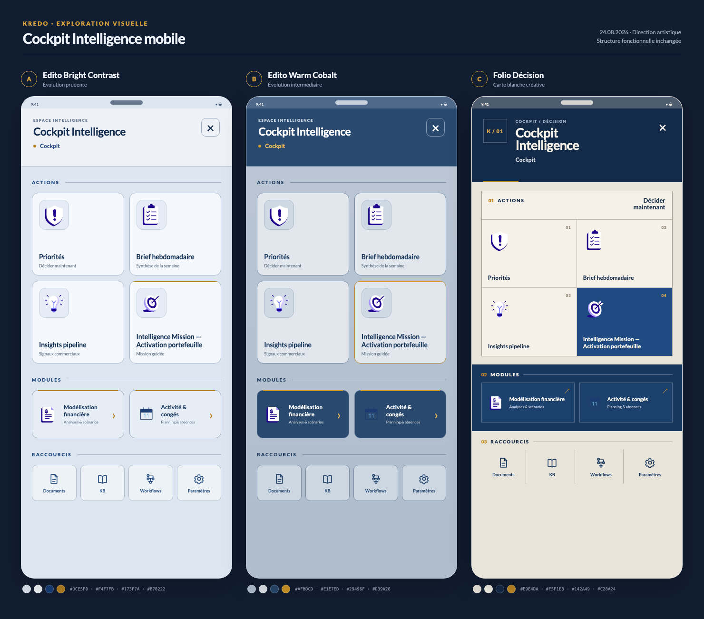
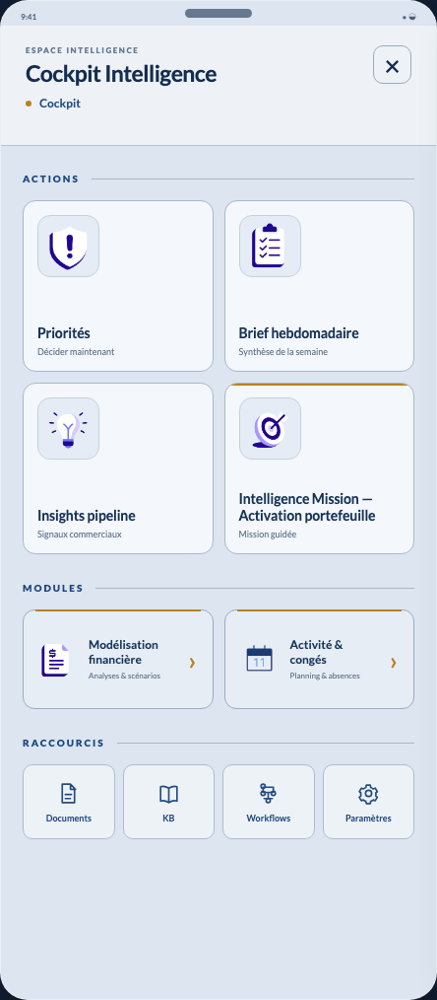
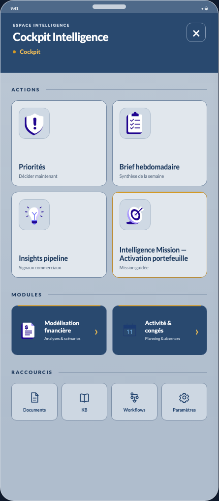
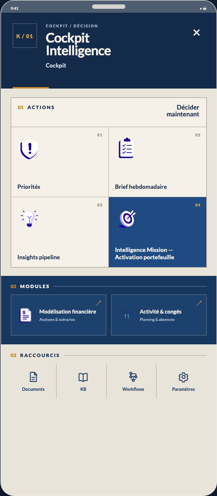

# Cockpit Intelligence mobile — exploration visuelle

Date : 24 août 2026  
Périmètre : direction artistique uniquement — aucune modification de logique, de hiérarchie fonctionnelle ou de quantité d’items.



## Invariants conservés

- Header : `Cockpit Intelligence`, contexte `Cockpit`, fermeture.
- Actions : 4 cartes, grille de 2 colonnes.
- Modules : 2 cartes, grille de 2 colonnes.
- Raccourcis : 4 accès sur une ligne.
- Hiérarchie : Actions → Modules → Raccourcis.
- Iconographie KREDO existante, flat design, bordures structurantes, brass parcimonieux.
- Cibles tactiles toutes supérieures à 44 px.

## Variante A — Edito Bright Contrast



### Palette principale

| Rôle | Valeur |
|---|---|
| Canvas froid teinté | `#DCE5F0` |
| Surface haute | `#EEF2F6` |
| Cartes | `#F4F7FB` |
| Cobalt structurant | `#173F7A` |
| Brass | `#B78222` |

### Logique visuelle

Le panneau devient une surface claire gris-bleu continue. Les cartes ne sont pas blanches : elles sont légèrement plus froides et plus élevées en luminosité que le canvas, séparées par des bordures bleu-gris franches. Le header ne rompt pas la continuité lumineuse.

- **Cobalt** : titres, libellés de sections, iconographie secondaire et texte de navigation.
- **Brass** : contexte actif, filet de l’Action Mission, filets des Modules et chevrons.
- **Actions** : grandes cartes claires avec puits d’icône, sous-libellé fonctionnel discret.
- **Modules** : surfaces un degré plus denses que les Actions, format horizontal.
- **Raccourcis** : boutons compacts, clairs et strictement secondaires.

Contrastes vérifiés : titre/header `12,27:1`, texte/carte `11,74:1`, label/canvas `7,44:1`.

### Micro-interactions

- **Ouverture** : montée du panneau en `220 ms`, courbe `cubic-bezier(.22,.8,.24,1)`, fondu du backdrop en `140 ms`.
- **Press** : compression à `0,98` pendant `80 ms`, fond de carte légèrement plus cobalt, sans ombre ajoutée.
- **Sélection** : filet brass de 2 px en tête + bordure cobalt renforcée ; le layout ne bouge pas.
- **Transition interne** : contenu sortant à `-10 px`, entrant à `+10 px`, fondu croisé en `180 ms`; header stable.
- **Async** : mince rail cobalt dans le bas de la carte ; état terminé remplacé par une coche stable et un libellé court.

### Avantages

- Meilleur confort prolongé et meilleure lisibilité.
- Traduction la plus fidèle de `edito_bright_design` sur une surface d’action.
- Faible coût d’adoption et comparaison directe avec l’existant.

### Limites

- Perd une partie de l’immersion propre au Cockpit cobalt.
- Personnalité plus discrète ; risque de proximité avec d’autres surfaces analytiques claires.
- Le brass doit rester très contrôlé pour ne pas paraître décoratif.

## Variante B — Edito Warm Cobalt



### Palette principale

| Rôle | Valeur |
|---|---|
| Canvas minéral cobalt | `#AFBDCD` |
| Cartes Actions | `#E1E7ED` |
| Header / Modules | `#29496F` |
| Cobalt de structure | `#203B5E` |
| Brass | `#D39A26` |

### Logique visuelle

Le canvas devient un gris cobalt moyen, légèrement minéral. Les Actions restent claires et dominantes, tandis que le header et les Modules forment deux masses cobalt denses. Le panneau conserve ainsi une empreinte Intelligence immédiate sans saturer tout l’écran.

- **Cobalt** : header, Modules, titres de section et éléments de navigation.
- **Brass** : contexte, Action Mission, filets de Modules et chevrons ; présence plus nette que dans A.
- **Actions** : surfaces claires posées sur un canvas plus dense, contraste de silhouette élevé.
- **Modules** : cartes cobalt profondes, clairement séparées du contenu principal.
- **Raccourcis** : boutons minéraux ton sur ton, présence basse mais lisible.

Contrastes vérifiés : titre/header `9,22:1`, texte/carte `9,54:1`, label/canvas `5,94:1`, texte/module `8,82:1`.

### Micro-interactions

- **Ouverture** : montée en `240 ms`; le header cobalt apparaît avec le panneau, puis le contenu se stabilise sur les 40 dernières millisecondes.
- **Press** : compression à `0,975`, assombrissement de 4 % et accent brass plus franc pendant `90 ms`.
- **Sélection** : l’Action sélectionnée bascule en cobalt `#29496F`, texte clair, filet brass conservé ; état très identifiable.
- **Transition interne** : translation horizontale de `12 px` et fondu en `190 ms`; le contexte remplace `Cockpit` par le nom de l’Action.
- **Async** : rail brass de 2 px dans la carte sélectionnée, progression cobalt interne ; succès en coche claire sur pastille cobalt.

### Avantages

- Meilleur pont entre le Cockpit sombre et l’univers Edito Bright.
- Identité Intelligence immédiatement reconnaissable sans fatigue cobalt plein écran.
- Hiérarchie Actions / Modules particulièrement nette.
- Brass plus présent, mais toujours fonctionnel.

### Limites

- Plus dense visuellement que A.
- Demande une discipline forte sur les niveaux de bleu afin d’éviter un retour progressif au tout-cobalt.
- Les Modules sombres devront conserver des contenus courts.

## Variante C — Folio Décision



### Palette principale

| Rôle | Valeur |
|---|---|
| Papier minéral | `#E9E4DA` |
| Folio Actions | `#F5F1E8` |
| Navy cobalt | `#142A49` |
| Cobalt sélection | `#1F4B82` |
| Brass | `#C28A24` |

### Logique visuelle

La surface devient un folio de décision : header graphique navy, Actions regroupées dans une matrice éditoriale numérotée, Modules installés dans une bande cobalt et Raccourcis traités comme un index de fin de page. La profondeur vient uniquement de la segmentation des surfaces, jamais d’ombres.

- **Cobalt** : chapitre d’ouverture, bande Modules, cellule sélectionnée et structure de lecture.
- **Brass** : index, numérotation, filet sous le header et états actifs.
- **Actions** : matrice 2 × 2 continue, sans multiplication de cartes flottantes ; la sélection devient un véritable repère de chapitre.
- **Modules** : bande transversale sombre, deux sous-surfaces analytiques.
- **Raccourcis** : index linéaire sans fonds individuels, séparé par filets verticaux.

Contrastes vérifiés : navy/papier `11,37:1`, texte clair/cobalt sélection `7,80:1`.

### Micro-interactions

- **Ouverture** : header en place en `160 ms`, folio montant de `12 px` en `200 ms` avec un décalage de `25 ms` ; aucune cascade carte par carte.
- **Press** : cellule teintée cobalt à 6 %, index brass renforcé, compression à `0,985`.
- **Sélection** : cellule entièrement cobalt, numéro brass et texte clair — état illustré sur l’Action Mission.
- **Transition interne** : le numéro de chapitre reste ancré ; contenu entrant glissé de `14 px` en `190 ms`, comme un changement de feuillet sans effet de page réaliste.
- **Async** : l’index de cellule devient un statut (`•`, `••`, `✓`) accompagné d’un libellé textuel ; fin de traitement signalée par un filet brass fixe.

### Avantages

- Direction la plus mémorable et la plus éditoriale.
- Peut devenir un langage transversal fort pour les surfaces Intelligence.
- Excellente distinction des trois niveaux fonctionnels sans ombres ni effets génériques.
- Le système d’index offre un support naturel aux transitions et aux états async.

### Limites

- Rupture plus importante avec le panneau actuel.
- Nécessite une validation d’usage sur petits écrans et avec traductions longues.
- La matrice continue est moins réutilisable si le nombre d’Actions devient variable.
- Le beige minéral doit être aligné avec les tokens KREDO avant industrialisation.

## Comparatif

Échelle : 1 = faible, 5 = excellent.

| Critère | A — Bright Contrast | B — Warm Cobalt | C — Folio Décision |
|---|---:|---:|---:|
| Cohérence KREDO | 5 | **5** | 4 |
| Confort mobile | **5** | 4,5 | 4,5 |
| Premium | 4,5 | **5** | **5** |
| Lisibilité | **5** | 4,5 | 4,5 |
| Personnalité | 3,5 | 4,5 | **5** |
| Continuité avec l’existant | 4 | **5** | 3,5 |
| Potentiel de nouveau langage Intelligence | 4 | **5** | **5** |

## Recommandation

**Retenir la variante B — Edito Warm Cobalt.**

Elle répond le plus précisément au problème initial : réduire l’intensité du cobalt plein écran sans effacer le caractère du Cockpit. Les Actions deviennent plus confortables grâce à leurs surfaces claires ; le header et les Modules conservent une densité de marque forte ; le brass garde une fonction d’orientation et d’état. Elle offre aussi le meilleur chemin d’industrialisation, car l’architecture actuelle reste intacte et les écarts se concentrent sur les tokens de surface, de bordure et d’état.

La variante A constitue un excellent mode de repli si les tests utilisateurs privilégient nettement le confort maximal. La variante C mérite d’être conservée comme piste de langage futur pour des parcours Intelligence plus narratifs, mais pas comme remplacement immédiat du panneau générique.

## Fichiers

- `mockups.html` : source déterministe des trois maquettes.
- `styles.css` : palette et traitement visuel.
- `render.mjs` : export Playwright reproductible.
- `cockpit-intelligence-mobile-comparison.png` : planche côte à côte.
- `cockpit-intelligence-mobile-variant-a.png`, `-b.png`, `-c.png` : vues isolées.

Régénération :

```bash
node docs/DESIGN/explorations/cockpit-intelligence-mobile-2026-08-24/render.mjs
```
