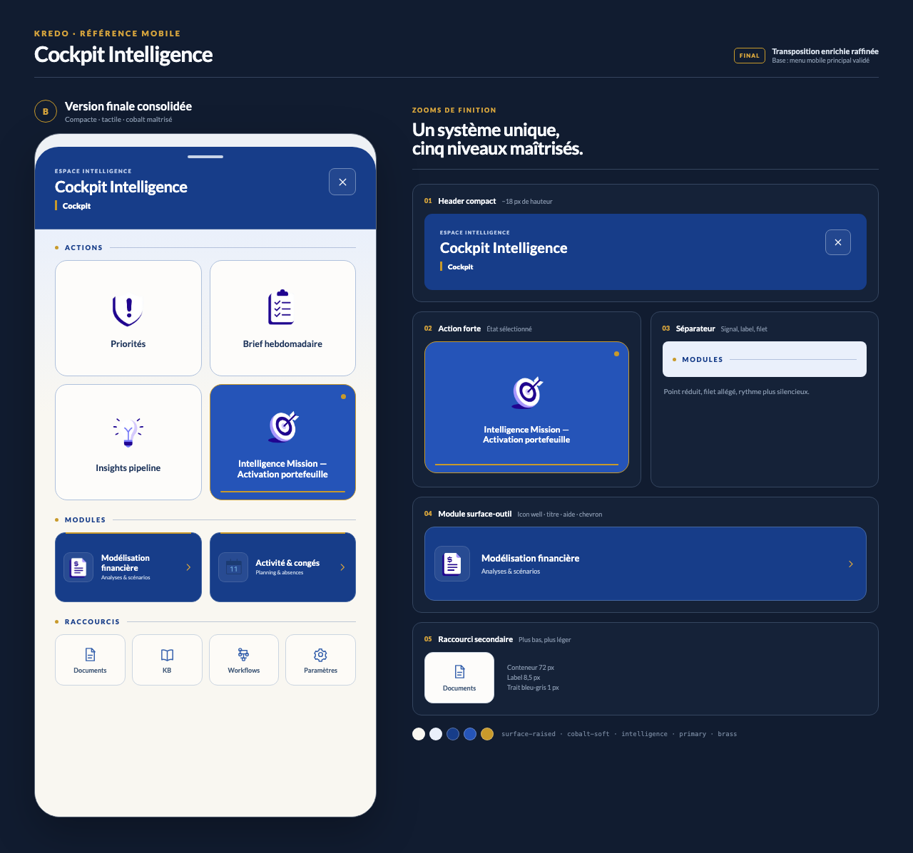

# Cockpit Intelligence mobile — version finale consolidée

Date : 24 août 2026  
Statut : **référence visuelle finale**  
Base verrouillée : proposition B — Transposition enrichie.



## Ajustements réalisés

### Header

- Hauteur réduite de `134 px` à `116 px`.
- Padding ramené de `37 / 30 / 20 px` à `30 / 28 / 15 px`.
- Titre maintenu à un niveau dominant de `22 px`.
- Contexte rapproché du titre, décalé d’un pixel supplémentaire et passé en graisse forte ; filet brass inchangé.
- Bouton de fermeture réduit de `42 px` à `38 px`, tout en conservant une zone tactile confortable avec son environnement immédiat.
- Poignée affinée à `50 × 4 px`.

### Actions

- Hauteur réduite de `171 px` à `163 px` pour un panneau plus compact.
- Cartes neutres portées sur la surface ivoire (`#FDFCFA`) et bordure bleu-gris très légèrement renforcée pour mieux se détacher du cobalt-soft.
- Icônes neutres ramenées à `58 px` ; icône Mission conservée légèrement plus grande à `61 px`.
- Espacement icône/titre réduit de `17 px` à `14 px`.
- Mission maintenue en cobalt franc avec bordure brass de `1,5 px`, point d’état et rail inférieur.
- Aucun sous-texte ajouté aux Actions : la relation avec les grandes tuiles du menu reste plus forte et la lecture au pouce plus immédiate.

### Modules

- Modules portés à `98 px` afin d’installer une vraie surface-outil sans rivaliser avec les Actions.
- Fond Intelligence `#173D89`, bordure fonctionnelle `#4567A1` et filet brass supérieur.
- Ajout d’un puits d’icône de `42 px` pour renforcer leur identité de composant-outil.
- Hiérarchie explicite : titre `11,5 px`, aide `7,5 px`, chevron brass.
- Sous-libellés ajoutés uniquement aux Modules : `Analyses & scénarios` et `Planning & absences`.

### Raccourcis

- Hauteur réduite de `84 px` à `72 px`.
- Icônes réduites de `27 px` à `23 px`.
- Labels fixés à `9 px`, avec une encre bleu-gris légèrement renforcée plutôt que cobalt franc.
- Surface presque transparente et bordure neutre : présence lisible, mais clairement tertiaire.

### Titres et séparateurs

- Point brass réduit de `6 px` à `5 px`.
- Label ajusté à `9,5 px`.
- Filet ramené à `0,5 px` avec cobalt à 26 % d’opacité.
- Espacement point/label/filet réduit à `9 px`.

### Rythme vertical

- Espace sous le header réduit par un padding supérieur de contenu de `16 px`.
- Espacement entre groupes ramené de `21 px` à `18 px`.
- Marge basse portée à `34 px` pour préserver une sortie de panneau calme malgré la compacité supérieure.

## Arbitrages

1. **La compacité ne doit pas devenir de la densité.** Le gain de hauteur est concentré dans le header, les Actions et les Raccourcis ; les Modules gagnent au contraire quelques pixels afin de mieux exprimer leur rôle.
2. **Le brass reste un signal.** Il marque l’état actif, l’entrée des Modules et les sections, mais ne devient jamais une couleur de remplissage décorative.
3. **Les Actions restent proches du menu.** Une icône et un libellé suffisent. Les sous-textes sont réservés aux Modules, où ils apportent une information d’orientation utile.
4. **Le cobalt dense reste localisé.** Header, Action active et Modules portent l’identité Intelligence ; le reste du panneau demeure ivoire ou cobalt-soft.
5. **Les Raccourcis assument leur rang tertiaire.** Leur réduction améliore la hiérarchie sans compromettre les cibles tactiles.

## Contrastes vérifiés

| Couple | Ratio |
|---|---:|
| Texte blanc / header Intelligence | `10,17:1` |
| Texte / Action neutre | `12,61:1` |
| Texte blanc / Action Mission | `6,91:1` |
| Texte blanc / Module | `10,17:1` |
| Sous-texte / Module | `6,01:1` |
| Label / Raccourci | `6,68:1` |
| Titre de section / cobalt-soft | `8,89:1` |

## Fichiers

- `cockpit-intelligence-mobile-final.png` : planche finale avec zooms.
- `cockpit-intelligence-mobile-final-panel.png` : maquette complète isolée, `480 × 960 px`.
- `cockpit-intelligence-mobile-final-details.png` : mini-planche de composants.
- `final.html` et `final.css` : source déterministe.
- `render.mjs` : export Playwright reproductible.
- `manifest.json` : provenance et invariants.

Régénération :

```bash
node docs/DESIGN/explorations/cockpit-intelligence-mobile-final-2026-08-24/render.mjs
```
