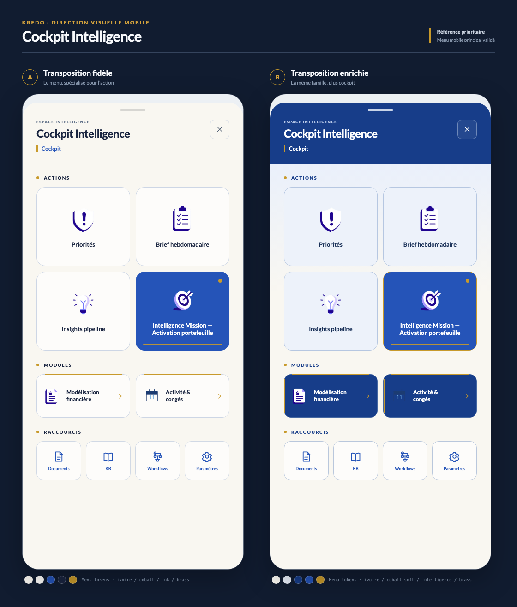
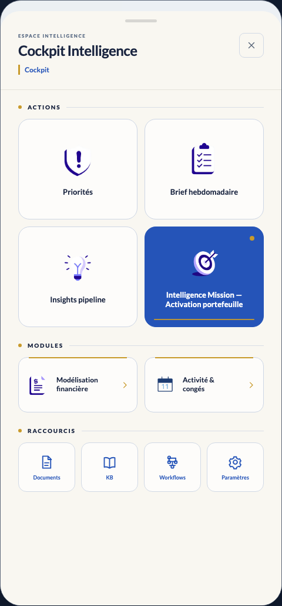
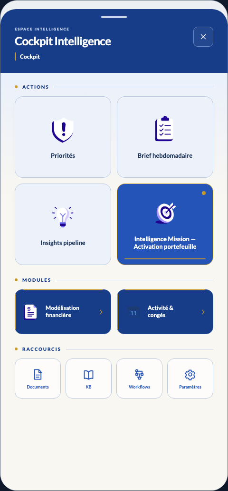

# Cockpit Intelligence mobile — déclinaison du menu principal validé

Date : 24 août 2026  
Périmètre : direction visuelle uniquement. La logique, la structure fonctionnelle, le nombre d’Actions, de Modules et de Raccourcis restent inchangés.



## Principe commun

Les deux propositions traitent le Cockpit comme le **cousin opérationnel du menu principal mobile**, et non comme une nouvelle famille graphique.

Éléments repris directement du menu validé :

- silhouette de bottom sheet à grands coins supérieurs ;
- poignée courte centrée ;
- fond ivoire KREDO et surfaces presque blanches ;
- composition mobile très aérée ;
- grille principale 2 × 2 ;
- une seule tuile active en aplat cobalt ;
- grands rayons de cartes et traits fins bleu-gris ;
- iconographie centrée au-dessus des libellés principaux ;
- petits accès secondaires alignés en grille compacte ;
- absence d’ombres internes lourdes.

Spécialisation Cockpit commune :

- header identitaire avec titre, contexte de page et fermeture ;
- sections `Actions`, `Modules`, `Raccourcis` explicitement séparées ;
- Actions dominantes ;
- Modules horizontaux, plus opérationnels que les tuiles de navigation ;
- brass réservé au contexte, à l’Action active et aux entrées de Modules ;
- iconographie Intelligence existante conservée.

## Proposition A — Transposition fidèle



### Logique visuelle

La feuille ivoire du menu est conservée sur toute la hauteur. La densité cobalt provient essentiellement de l’Action sélectionnée, des icônes et de la signalétique. C’est la traduction la plus directe du menu validé.

### Palette

| Rôle | Token / valeur |
|---|---|
| Fond de feuille | `surface-raised` / `#F9F7F1` |
| Cartes | `surface` / `#FDFCFA` |
| Cobalt actif | `brand-primary` / `#2554B8` |
| Encre | `brand-ink` / `#1A2540` |
| Brass | `brand-brass` / `#C89A2B` |
| Bordures | bleu-gris dérivé de `border-strong` |

Contrastes structurants : encre/feuille `14,18:1`, encre/carte `14,81:1`, blanc/cobalt actif `6,91:1`.

### Traitements

- **Header** : fond ivoire, titre fort aligné à gauche, contexte marqué par un filet brass, fermeture identique à un contrôle du menu.
- **Actions** : géométrie des grandes tuiles du menu ; une seule Action cobalt représente l’état sélectionné ou prioritaire.
- **Modules** : cartes plus basses et horizontales, mais mêmes surface, rayon et bordure que les tuiles du menu.
- **Raccourcis** : quatre petites tuiles directement dérivées de la grille secondaire du menu.

### Micro-interactions

- **Ouverture** : montée du bottom sheet en `260 ms`, même cinématique que `AppDrawer`; poignée et contenu se déplacent ensemble.
- **Press** : compression à `0,98` pendant `90 ms`; la bordure cobalt gagne légèrement en intensité.
- **Sélection** : remplissage cobalt, point brass en angle et rail brass inférieur ; aucun déplacement du contenu.
- **Transition interne** : header stable, contenu sortant à `-10 px` et entrant à `+10 px` avec fondu croisé en `180 ms`; le contexte affiche le nom de l’Action ou du Module.
- **Async** : le rail brass inférieur devient progressif ; état terminé remplacé par une coche et un libellé textuel court.

### Avantages

- Relation au menu immédiatement perceptible.
- Excellent confort mobile et faible fatigue visuelle.
- Réutilise presque exclusivement les tokens et la géométrie déjà validés.
- Généralisation simple aux autres pages du Cockpit.

### Limites

- Identité Intelligence plus discrète lorsque aucune Action n’est sélectionnée.
- Peut sembler proche d’un menu fonctionnel si les séparateurs de sections sont affaiblis.
- Le header clair porte moins de caractère que le Cockpit historique.

## Proposition B — Transposition enrichie



### Logique visuelle

La géométrie du menu reste strictement reconnaissable, mais les tokens cobalt existants sont redistribués : header Intelligence, léger fond cobalt-soft derrière les Actions et Modules cobalt. La personnalité Cockpit est plus forte sans introduire une nouvelle DA.

### Palette

| Rôle | Token / valeur |
|---|---|
| Fond de feuille | `surface-raised` / `#F9F7F1` |
| Fond Actions | `cockpit-cobalt-soft` / `#EAF0FB` |
| Header / Modules | `domain-intelligence` / `#173D89` |
| Cobalt actif | `brand-primary` / `#2554B8` |
| Brass | `brand-brass` / `#C89A2B` |

Contrastes structurants : blanc/header Intelligence `10,17:1`, encre/carte soft `11,50:1`, Intelligence/fond soft `8,89:1`, blanc/cobalt actif `6,91:1`.

### Traitements

- **Header** : bande cobalt Intelligence pleine largeur, titre blanc et contexte au filet brass ; c’est la principale signature Cockpit.
- **Actions** : géométrie inchangée par rapport à A et au menu ; cartes cobalt-soft, Action active en cobalt franc et bordure brass.
- **Modules** : mêmes dimensions que A mais surfaces Intelligence sombres, filets brass et chevrons ; distinction métier nettement renforcée.
- **Raccourcis** : retour au fond ivoire et aux petites tuiles blanches du menu pour clore la hiérarchie.

### Micro-interactions

- **Ouverture** : sheet et header montent comme une seule surface en `260 ms`; le contenu se stabilise avec un fondu de `60 ms` en fin de course.
- **Press** : Action cobalt-soft assombrie de 4 %, compression à `0,98`; Module éclairci de 6 %.
- **Sélection** : aplat cobalt franc, bordure brass, point d’état et rail inférieur ; contraste identique au menu actif.
- **Transition interne** : bande header conservée ; titre du contexte mis à jour en `160 ms`, contenu glissé de `12 px` en `190 ms`.
- **Async** : progression sur rail brass ; pendant le traitement, le point d’état pulse une seule fois à chaque changement d’étape, sans animation permanente.

### Avantages

- Identité Cockpit forte au premier regard.
- Relation au menu préservée par la silhouette, les rayons, les grilles et les proportions.
- Hiérarchie Actions / Modules / Raccourcis plus claire que dans A.
- Utilise uniquement des couleurs déjà présentes dans KREDO.

### Limites

- Header et Modules plus denses visuellement.
- Demande de conserver des libellés de Modules courts sur petits écrans.
- Une extension excessive des surfaces cobalt ferait perdre la relation au menu ; le corps ivoire doit rester majoritaire.

## Comparaison

Échelle : 1 = faible, 5 = excellent.

| Critère | A — Fidèle | B — Enrichie |
|---|---:|---:|
| Cohérence avec le menu principal | **5** | 4,5 |
| Identité Cockpit Intelligence | 4 | **5** |
| Qualité premium | 4,5 | **5** |
| Lisibilité | **5** | 4,5 |
| Confort mobile | **5** | 4,5 |
| Hiérarchie visuelle | 4,5 | **5** |
| Cohérence KREDO | **5** | **5** |
| Généralisation aux autres pages | **5** | 4,5 |

## Recommandation

**Retenir la proposition B — Transposition enrichie.**

Elle atteint le meilleur équilibre entre les deux objectifs du brief : la relation avec le menu reste évidente grâce à une géométrie pratiquement inchangée, tandis que le header Intelligence et les Modules cobalt donnent au Cockpit une fonction immédiatement différente. Cette proposition n’invente pas une nouvelle direction : elle spécialise le menu avec les tokens `domain-intelligence`, `cockpit-cobalt-soft`, `brand-primary` et `brand-brass` déjà présents dans KREDO.

La garde-fou d’industrialisation est simple : **conserver au moins les deux tiers de la surface visible en ivoire ou cobalt-soft**, et réserver le cobalt dense au header, à l’Action active et aux Modules. Si ce ratio ne peut être tenu sur une page donnée, revenir au traitement A.

## Fichiers

- `mockups.html` : source déterministe des deux maquettes.
- `styles.css` : traitements et palettes.
- `render.mjs` : export reproductible via Playwright.
- `manifest.json` : provenance et inventaire des exports.
- `cockpit-intelligence-menu-derived-comparison.png` : comparaison côte à côte.
- `cockpit-intelligence-menu-derived-variant-a.png` et `-b.png` : vues isolées.

Régénération :

```bash
node docs/DESIGN/explorations/cockpit-intelligence-mobile-menu-derived-2026-08-24/render.mjs
```
