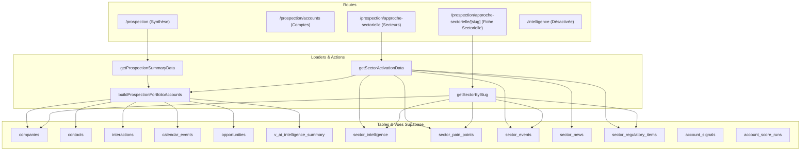
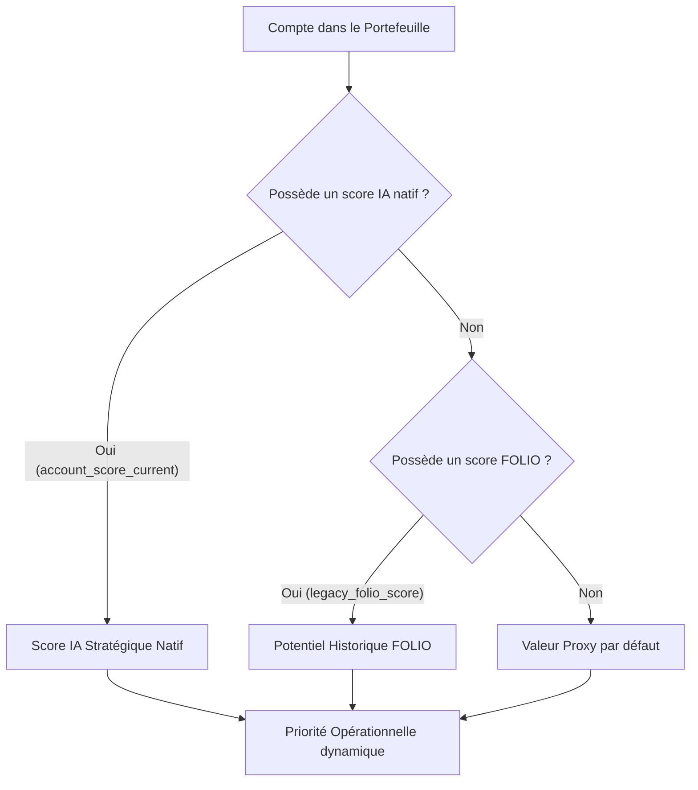

# KREDO — Lot 0 : Contrat et Inventaire « Business Intelligence »

Ce document fige l'état réel de l'application KREDO (dépôt `guillaumekachanine-dev/kredo_sales_app` branché sur la base de données live Supabase `jvzgmhvwirsbdkjpmvla`) et établit le cadre de migration technique et fonctionnel pour le Lot 1 du chantier « Business Intelligence » (activation de l'onglet `/intelligence`).

---

## 1. État réel du dépôt

L'audit de l'arbre de travail a été réalisé sur la branche `main` après synchronisation :

- **Branche active** : `main`
- **Dernier Commit** : `ccade0996791873a8a0d36def24c6ac77c466d4e`  
  *Sujet* : `feat(sector): étude sectorielle Santé, MedTech & Médico-social + réconciliation doc`
- **Statut local** : Propre. Les modifications locales de l'utilisateur ont été préservées via `git stash` pour garantir que l'audit s'exécute sur le code validé en amont.
- **Synchronisation** : `git pull --ff-only origin main` a confirmé que le dépôt local était déjà parfaitement à jour avec l'origine.

---

## 2. Baseline Supabase vérifiée

Les statistiques réelles de la base de données de production Supabase ont été recalculées en lecture seule le 17 juillet 2026. Voici la comparaison entre la baseline théorique et les données observées :

| Indicateur | Baseline théorique | Valeur réelle observée | Statut / Table Supabase |
| :--- | :---: | :---: | :--- |
| **Comptes totaux** | ~96 | **96** | `companies` |
| **Comptes avec secteur** | 95 | **95** | `companies WHERE sector_id IS NOT NULL` |
| **Secteurs au total** | 14 | **14** | `sector_intelligence` |
| &emsp;*Secteurs actifs (`active`)* | 4 | **4** | `status = 'active'` (Parfumerie, Banque, Nutraceutique, Santé) |
| &emsp;*Secteurs en veille (`watch`)* | 10 | **10** | `status = 'watch'` (Conteneurs vides en attente d'étude) |
| **Signaux totaux** | 750 | **750** | `account_signals` |
| &emsp;*Couverture comptes* | 93 | **93** | Comptes distincts avec au moins 1 signal lié |
| **Comptes avec score IA natif** | 7 | **7** | Comptes avec historique dans `account_score_runs` |
| **Comptes avec score historique FOLIO** | 78 | **78** | `companies WHERE legacy_folio_score IS NOT NULL` |

> [!WARNING]
> **Piège des données synthétiques (Seed data) :**  
> L'analyse de la base révèle que sur 143 interactions, **70 sont synthétiques / fictives** (marquées par `details->>'fictional'='true'`, `details->>'synthetic'='true'`, ou par la présence de batchs d'injection dans les métadonnées). De même, de nombreuses opportunités et missions proviennent du jeu de test initial. Lors du Lot 1, les composants de confiance devront exclure ou signaler clairement ces éléments fictifs pour ne pas polluer l'activité réelle de livraison ou de prospection.

---

## 3. Cartographie Routes → Composants → Loaders → Tables

### 3.1 Cartographie actuelle



### 3.2 Audit de navigation et des liens
- **`/prospection`** : Diffuse activement la **Synthèse**. Il aiguille vers `SyntheseDesktopView` ou `SyntheseMobileView` via `getDashboardDevice()`.
- **`/prospection/approche-sectorielle`** : Possède ses deux layouts distincts :
  - **Desktop** : Rendu dynamique complet via `SectorActivationDesktopView` (alimenté par le loader lourd `getSectorActivationData`).
  - **Mobile** : Liste simple de cartes sectorielles rendue inline via `SectorCardMobile` (utilisant `getSectors()`).
- **`/intelligence`** : **Désactivée** dans `src/lib/navigation/main-menu.config.ts` via les clés `comingSoon: true` et `disabled: true`.
- **Liens internes vers l'ancien parcours sectoriel** :  
  Actuellement, 15 fichiers de composants et d'actions (par ex. `SectorSnapshotContent.tsx`, `SelectedCommercialWindowPanel.tsx`, `SectorStudiesCollapsible.tsx`, etc.) pointent vers les routes sous `/prospection/approche-sectorielle/*`. Le Lot 1 devra rediriger ces liens vers `/intelligence` ou conserver un routage rétro-compatible.

### 3.3 Analyse des loaders et duplications
1. **Duplication majeure du portefeuille** : `getProspectionSummaryData` (utilisé par la Synthèse) et `getSectorActivationData` (utilisé par l'approche sectorielle) exécutent en parallèle exactement les mêmes requêtes de base pour récupérer le portefeuille (tables `companies`, `contacts`, `interactions`, `calendar_events`, `opportunities`, `v_ai_intelligence_summary`), et appellent tous les deux `buildProspectionPortfolioAccounts`.
2. **Données Synthèse-only** : Le calcul et la configuration des métadonnées de confiance (`trust` bundle) et les KPI globaux simples du portefeuille.
3. **Données Approche-only** : Toutes les informations réglementaires, événements sectoriels, news, pain points, playbooks et structures de filtrage par practice/horizon.
4. **Données Communes** : Le tableau des comptes calculés `ProspectionPortfolioAccount[]`.
5. **Dette technique identifiée** : `STRATEGIC_SECTOR_CONFIG` a été définitivement purgé de l'application (suppression de la double source de vérité mobile/desktop), les deux versions lisent désormais directement la base via Supabase.

---

## 4. Contrat fonctionnel V1 (Future page BI)

L'onglet **Business Intelligence** centralise et unifie la synthèse du portefeuille et l'activation commerciale par les opportunités sectorielles.

- **Filtres de recherche et de scope** :  
  - Par Secteur (tous vs secteur ciblé) ;
  - Par Practice KREDO (`data_ai`, `cloud_eng`, `product`, `cyber`) ;
  - Par Niveau d'Urgence / Criticité (`critical`, `high`, `medium`, `low`) ;
  - Par Type de signal (`regulatory`, `news`, `event`) ;
  - Par Horizon temporel (`open` = fenêtres ouvertes, `pipeline` = opportunités futures non expirées).
- **Modes de visualisation** :
  - **Vue CommandCenter (Cockpit de pilotage)** : Affiche les KPI clés, la matrice Potentiel × Reach de distribution des comptes, et la liste ordonnée des comptes à cibler en priorité.
  - **Vue SectorActivation (Vitrine d'opportunités)** : Affiche la chronologie des fenêtres de tir commerciales (réglementations, news chaudes, événements) et permet de déplier le détail des playbooks sectoriels.
- **Pas de configuration en dur** : Toutes les informations, y compris les logos de sociétés, les TJM moyens, les caveats de transparence et les arguments de vente, doivent provenir de la base de données live, sans fallback codé en dur dans le code client.

---

## 5. Contrat `BusinessIntelligenceSnapshot`

Le loader unifié du Lot 1 servira une structure de données unique partagée. Voici la définition TypeScript simplifiée du contrat de données :

```typescript
export type DataOrigin = "REAL_NATIVE" | "REAL_LEGACY" | "PROXY" | "FUTURE_DEMO";

export interface DataTrustMeta {
  id: string;
  label: string;
  primaryOrigin: DataOrigin;
  origins: DataOrigin[];
  formula: string;
  freshness: {
    latestAt: string | null;
    label: string;
  };
  completeness: {
    value: number; // pourcentage de couverture
    label: string;
  };
  limitations: string[];
}

export interface BusinessIntelligenceSnapshot {
  // 1. Métadonnées et fraîcheur
  state: "ready" | "error";
  generatedAt: string;
  lastUpdatedAt: string | null;

  // 2. Portefeuille de comptes calculés
  accounts: ProspectionPortfolioAccount[];
  
  // 3. Signaux et actualités de veille
  signals: {
    id: string;
    companyId: string;
    title: string;
    summary: string | null;
    category: string;
    relevanceScore: number;
    urgencyScore: number;
    detectedAt: string;
    recommendedAction: string | null;
  }[];

  // 4. Scores stratégiques natifs (runs de score consolidés)
  scores: Record<string, {
    runId: string;
    scoreValue: number;
    scoreBand: "A" | "B" | "C" | "D";
    confidenceScore: number;
    calculatedAt: string;
    components: {
      key: string;
      label: string;
      normalizedScore: number;
      weight: number;
      weightedContribution: number;
      freshnessStatus: string;
    }[];
  }>;

  // 5. Secteurs cibles
  sectors: SectorActivationSector[];

  // 6. Fenêtres d'opportunités réglementaires et événementielles
  windows: SectorActivationWindow[];

  // 7. Options de filtres dynamiques calculées depuis le snapshot
  filterOptions: SectorActivationFilterOptions;

  // 8. Confiance, provenance et auditabilité globale
  trust: {
    accountPotential: DataTrustMeta;
    accountReach: DataTrustMeta;
    accountMomentum: DataTrustMeta;
    priorityCalculated: DataTrustMeta;
  };
}
```

---

## 6. Règles de score et de confiance

Pour éviter toute confusion en clientèle ou lors de la prospection, le système doit impérativement expliciter la nature des indicateurs :



### 6.1 Distinction des indicateurs
1. **Priorité Opérationnelle (Calculée)** : Indicateur de ciblage à court terme (sur 30d, 90d ou 180d). Elle est calculée dynamiquement par le code en croisant le potentiel, la maturité des contacts (`reach`), et le momentum d'activité récent.
2. **Score Stratégique Natif** : Issu du moteur de score KREDO (`account_score_runs`). Il est fondé sur l'évaluation analytique des forces et faiblesses réelles d'un compte (DORA, cloud maturity, etc.) et stocké en base.
3. **Potentiel Historique FOLIO** : Score historique importé de l'ancien outil (`legacy_folio_score` sur 5), présent sur 78 comptes.
4. **Valeur Proxy / Par Défaut** : Calculée à la volée lorsque le compte ne possède aucun historique.

### 6.2 Règles de représentation UI & Confiance
- **Provenance de la donnée** : Afficher un badge de provenance (`REAL_NATIVE` en or/cobalt, `REAL_LEGACY` en gris neutre, `PROXY` en pointillé discret).
- **Interdiction formelle de tromperie** : Il est interdit de présenter un score estimé ou proxy comme un score nativement calculé par l'IA de KREDO. L'absence de score doit être assumée.
- **Fraîcheur** : Le composant de score doit afficher la date du run (`calculated_at`) ou le statut de péremption (`stale`/`fresh`).

---

## 7. Composants à réutiliser, adapter ou supprimer

### 7.1 Réutilisation directe (Composants génériques propres)
- **`KpiCard`** (`src/components/ui/KpiCard.tsx`) : Rendu propre des indicateurs majeurs.
- **`PageFilterBar`** et **`PageFilterSelect`** : Barre de filtres fluides de Next.js.
- **`ScoreBar`** (`src/components/sector/blocks/ScoreBar.tsx`) : Barre de score compacte.
- **`HeaderCalendar`** & **`HeaderAlerts`** : Widgets de cockpit transversaux.

### 7.2 Extraction ou Adaptation (Logique réutilisable mais couplée)
- **`SectorActivationGrid`** (`src/components/prospection/sector-activation/SectorActivationGrid.tsx`) : Doit être extrait pour ne plus dépendre de l'ancien layout `/prospection`.
- **`SelectedCommercialWindowPanel`** : Panneau latéral d'action d'une fenêtre de tir. Doit être adapté pour l'affichage cockpit BI.
- **Matrice Potentiel × Reach** (`src/components/prospection/synthese/PotentialReachMatrix.tsx`) : Utilisé dans la Synthèse, doit être rendu plus générique pour être partagé ou déplacé dans la BI.

### 7.3 Suppression future (Dettes et vestiges après lot 1)
- L'ancienne route `/prospection/approche-sectorielle` et ses sous-pages.
- **Hacks Robertet** identifiés lors de l'audit :
  - **Fiche sectorielle (`SectorDetailView.tsx:229,232`)** : UUID Robertet (`544f9112-893c-4e1f-92f0-658aa308f458`) codé en dur pour forger les redirections des plans d'approche et de génération d'email.
  - **Tri des entreprises (`SectorDetailView.tsx:253-257`)** : Robertet est systématiquement forcé en première position de la liste des comptes sectoriels via un tri alphanumérique custom.
  - **Mock d'analyses de mails (`company-documents-mail-analytics.ts`)** : Code limité structurellement et par des tests unitaires aux comptes `"ROBERTET"`, `"ARKOPHARMA"`, et `"VOYAGE PRIVE"`.

---

## 8. Critères de parité pour le Lot 1

Pour valider le succès technique du Lot 1 (nouvelle page BI sous `/intelligence`), les éléments suivants doivent être strictement préservés à l'identique :

1. **Portefeuille identique** : Le nombre total de comptes (96) et leur répartition sectorielle (95 rattachés) doivent correspondre exactement.
2. **Priorité identique** : Les formules de calcul de `actionPriorityScore` et de `potentialScore` ne doivent pas dévier d'un seul point.
3. **Fenêtres préservées** : La chronologie des échéances réglementaires et les opportunités commerciales associées doivent être identiques en termes de comptage et de criticité.
4. **Parité fonctionnelle mobile** : La liste simplifiée des secteurs pour les écrans mobiles doit conserver sa distinction claire entre secteurs étudiés (`active`) et en préparation (`watch`).

---

## 9. Risques ou inconnues réelles

1. **Performances de chargement (Next.js SSR)** : Charger simultanément le portefeuille de comptes et le référentiel des 14 secteurs avec toutes leurs relations (échéances, pain points, news) peut ralentir la page. L'implémentation du loader unifié devra exploiter un cache intelligent ou des requêtes parallèles optimisées.
2. **Pollution du seed de test** : La présence massive d'opportunités et d'interactions de démonstration synthetic/synthetic-fictional risque d'induire le commercial en erreur. Une option de filtre ou un indicateur visuel de données réelles est requis.
3. **Sécurité et RLS sur `account_signals`** : Cette table n'autorise que la lecture (`SELECT`) côté client. Toute action future de curation de signaux (marquer comme traité, rejeter) devra transiter par des fonctions PostgreSQL `SECURITY DEFINER` (RPC) conformément à la doctrine KREDO.

---

## 10. Verdict pour le Lot 1

### **`GO`**

L'architecture actuelle de KREDO est saine, bien découpée en couches, et la réconciliation du schéma live Supabase confirme que les données réelles sont en parfaite adéquation avec la modélisation attendue. La suppression préalable des configurations statiques permet d'envisager le Lot 1 en toute sécurité, sous réserve de nettoyer les quelques comportements et UUID codés en dur pour Robertet.
