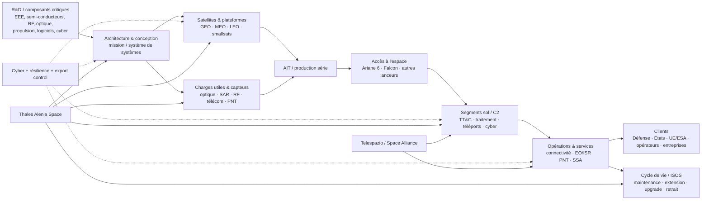

# Spatial, défense & systèmes critiques — Cartographie sectorielle et options stratégiques

**Snapshot : 10 août 2026 · Géographie principale : France / Europe, avec benchmark mondial · Compte étalon : Thales Alenia Space · Confiance globale : élevée sur les structures de marché, programmes publics et données financières publiées ; moyenne sur les chaînes fournisseurs propriétaires, coûts unitaires et parts de marché fines.**

## Synthèse exécutive

Le secteur « spatial, défense & systèmes critiques » ne constitue plus un marché spatial autonome au sens traditionnel. Il devient un **continuum de capacités souveraines** reliant satellites, capteurs, connectivité sécurisée, renseignement, positionnement-navigation-temps, segments sol, cyberdéfense et systèmes de commandement. Cette convergence est désormais explicite dans les politiques française et européenne : la stratégie spatiale française 2025–2040 met l'accent sur l'accès autonome à l'espace, la compétitivité industrielle, les capacités stratégiques et de défense et la souveraineté européenne ; le Commandement de l'espace français considère parallèlement le NewSpace, la dualité et les architectures résilientes comme indispensables pour répondre aux menaces. citeturn3search0turn3search2turn3search15

**Premier constat : le moteur de marché se déplace du satellite unitaire vers l'architecture de mission.** Les programmes les plus structurants assemblent désormais plusieurs orbites, des segments sol distribués, des services de communication, du traitement embarqué, du cyber et de la donnée. IRIS² en est l'archétype européen : concession public-privé de douze ans, plus de 290 satellites sur plusieurs orbites et segment sol associé, avec services gouvernementaux et commerciaux. SpaceRISE réunit SES, Eutelsat et Hispasat, avec Thales Alenia Space, Airbus Defence and Space, OHB, Telespazio, Thales et des opérateurs télécoms parmi les industriels impliqués. citeturn19search0

**Deuxième constat : Thales Alenia Space possède une position européenne particulièrement complète, mais pas totalement verticalisée.** La coentreprise Thales 67 % / Leonardo 33 % a réalisé **2,36 Md€ de chiffre d'affaires consolidé en 2025**, emploie plus de 8 000 personnes et est implantée dans sept pays européens. Elle couvre télécommunications, navigation, observation de la Terre, défense, science, exploration et infrastructures orbitales ; avec Telespazio, elle forme la Space Alliance, qui prolonge son empreinte vers les opérations et services. citeturn0search9turn0search12 Son avantage comparatif est donc celui d'un **architecte-intégrateur spatial européen dual**, particulièrement fort dans les charges utiles radar et optiques, les satellites institutionnels, le PNT, les télécommunications sécurisées et les grands programmes ESA/UE. Sa faiblesse relative par rapport à SpaceX est l'absence de contrôle intégré du lanceur, de la constellation et du service final ; face aux groupes américains de défense, elle dispose également d'une empreinte moindre dans les systèmes militaires complets non spatiaux.

**Troisième constat : l'Europe reste technologiquement crédible mais économiquement sous pression.** L'industrie spatiale européenne a réalisé environ **8,8 Md€ de ventes en 2024 et employait environ 66 000 équivalents temps plein**, tandis que les dépenses publiques européennes en amont atteignaient près de 11,4 Md€. Eurospace relève toutefois que la croissance commerciale récente des systèmes spatiaux mondiaux a été fortement tirée par Starlink. citeturn1search1 À l'autre extrême, le dépôt réglementaire de SpaceX montre qu'en 2025 son seul segment « Space » réalisait **4,086 Md$**, tandis que le groupe totalisait 18,674 Md$ et combinait lancement, fabrication, exploitation de satellites et connectivité dans un modèle fortement verticalisé. citeturn18search0turn18search8 La concurrence porte donc désormais autant sur **la cadence industrielle, le coût total de mission et la maîtrise du service** que sur les performances du satellite.

**Quatrième constat : la demande défense devient un accélérateur majeur.** La France a créé son Commandement de l'espace en 2019 ; sa stratégie spatiale militaire répond à la reconnaissance croissante de l'espace comme domaine opérationnel, également actée par l'OTAN fin 2019. citeturn2search0turn2search3turn2search4 En 2026, le programme DESIR confié par le CNES et la DGA à Thales Alenia Space pour la charge utile radar et le segment sol utilisateur matérialise la volonté française de disposer d'une capacité souveraine d'imagerie radar spatiale. citeturn26search2turn26search3 Le projet d'actualisation de la LPM présenté en avril 2026 prévoit en outre une accélération substantielle de l'effort de défense ; à ce stade, il faut toutefois le traiter comme **un projet d'actualisation**, et non comme un budget définitivement acquis. citeturn24search17

**Cinquième constat : les prochaines zones de différenciation sont déjà identifiables.** Elles sont moins dans « un meilleur satellite » que dans la combinaison de cinq briques : architectures proliférées et multi-orbites ; IA embarquée et traitement edge ; communications laser et quantiques ; service et maintenance en orbite ; composants et architectures cyber/export-control-by-design. Φsat-2 démontre déjà six applications d'IA embarquées sur un CubeSat ; ESA et la Commission développent une infrastructure quantique spatiale ; Thales Alenia Space conduit SAGA, HydRON et, depuis juin 2026, EROSS SC pour le servicing en orbite. citeturn24search12turn23search4turn23search10turn25search1turn26search16

**Conclusion stratégique.** Pour un acteur comme Thales Alenia Space, la meilleure trajectoire n'est probablement ni de tenter de reproduire la verticalisation intégrale de SpaceX, ni de rester un fabricant traditionnel de plateformes. Elle consiste à devenir le **référent européen des architectures spatiales souveraines et résilientes**, avec quatre extensions : industrialisation des constellations, services récurrents avec Telespazio, cyber/quantique/PNT intégrés dès la conception et maintenance en orbite. Cette position exploite davantage les actifs existants de TAS qu'une stratégie de diversification radicale.

La présente cartographie reprend les principes du kit méthodologique fourni : définition explicite du marché, compte étalon, distinction stricte des périmètres financiers, hiérarchie des sources, signalement des données non trouvées et priorité aux sources T1/T2. fileciteturn0file1 fileciteturn0file2 fileciteturn0file3 Elle adapte toutefois la méthode à une **analyse sectorielle et stratégique** plutôt qu'à une cartographie de prospection ESN : les données NAF, conventions collectives et scores d'appétence commerciale ne sont donc pas reprises, tandis que chaîne de valeur, technologies, souveraineté, supply chain et options stratégiques sont approfondies. Cette adaptation respecte le principe du kit selon lequel le périmètre doit précéder le chiffre et qu'un trou explicite vaut mieux qu'une donnée reconstruite. fileciteturn0file4 fileciteturn0file8

## Périmètre, économie du secteur et logique de création de valeur

Le périmètre retenu comprend **les systèmes spatiaux civils, militaires et duals ainsi que les systèmes critiques directement nécessaires à leur emploi opérationnel** : satellites, charges utiles, capteurs, lancement, segments sol, C2, communications sécurisées, ISR, PNT, surveillance de l'espace, cybersécurité spatiale, intégration de systèmes et services en orbite. Les armements terrestres, navals ou aéronautiques conventionnels sont hors périmètre sauf lorsqu'ils servent de benchmark pour les technologies de capteurs, de communications, d'ISR ou de systèmes critiques.

Cette définition est importante : comparer le chiffre d'affaires global de Thales ou Boeing au chiffre d'affaires spatial de TAS serait méthodologiquement faux. Le kit fourni demande explicitement de ne jamais utiliser un chiffre groupe pour caractériser une branche et de déclarer « non publié » lorsque le bon périmètre n'existe pas. fileciteturn0file1 fileciteturn0file4

Le marché européen reste fortement déterminé par la commande institutionnelle. En 2024, Eurospace évaluait les ventes de l'industrie spatiale européenne à environ **8,8 Md€** pour environ **66 000 ETP**, tandis que près de **11,4 Md€ de dépenses publiques spatiales amont** étaient engagées en Europe ; environ deux tiers de cette dernière enveloppe passaient par l'ESA. citeturn1search1 Le programme spatial de l'Union 2021–2027 est lui-même doté de **14,88 Md€**. citeturn1search2 Fin 2025, les États membres de l'ESA ont en outre approuvé environ **22,1 Md€ de souscriptions** lors de la conférence ministérielle CM25. citeturn1search6

La France renforce parallèlement l'orientation souveraineté/défense. La stratégie nationale 2025–2040 articule accès autonome à l'espace, compétitivité, défense, science et Europe ; le Conseil présidentiel de décembre 2025 a annoncé plus de **16 Md€ d'effort français civil et dual à horizon 2030**. citeturn3search2turn3search14 Cela ne signifie pas que les 16 Md€ constituent un marché directement accessible aux industriels : l'enveloppe englobe plusieurs formes de dépenses publiques et doit donc être utilisée comme indicateur de direction politique, non comme taille de marché adressable.

Les clients se répartissent en quatre blocs. Les **clients militaires** — DGA, ministères de la Défense, armées, OTAN et alliés — achètent capacités souveraines, communications sécurisées, ISR, PNT résilient et désormais action/résilience dans l'espace. Les **clients civils institutionnels** — ESA, Commission européenne, CNES, ASI, EUMETSAT et agences nationales — financent science, météo, Copernicus, navigation, télécommunications et démonstrateurs technologiques. Les **clients commerciaux** — opérateurs GEO/LEO, télécoms, fournisseurs de données — achètent plateformes, charges utiles ou capacité de service. Enfin, les **clients institutionnels duals** combinent besoins civils et sécurité, à l'image de COSMO-SkyMed ou IRIS². COSMO-SkyMed Second Generation appartient conjointement à l'ASI et au ministère italien de la Défense, est fabriqué par TAS et exploité par Telespazio : c'est un cas très représentatif du modèle dual européen. citeturn26search5turn26search15

Les modèles de revenu découlent directement de ces clientèles :

| Modèle économique / contrat type | Logique économique | Exemples publics et implication pour TAS |
|---|---|---|
| **Développement puis production institutionnelle** | NRE/R&D, qualification, fabrication, intégration, essais puis livraison ; revenus reconnus sur plusieurs années | Argonaut : contrat ESA de **862 M€** pour le développement et la livraison du Lunar Descent Element, TAS maître d'œuvre. citeturn25search0turn25search11 |
| **Programme par tranches / séries de satellites** | Premier lot contractuel puis options/tranches ; effet de série croissant | Sentinel-1 NG : TAS prime de deux satellites ; première tranche d'un accord total annoncé à **700 M€**. citeturn26search4turn26search14 |
| **Sous-traitance de charges utiles et sous-systèmes** | Contrat avec un autre prime, forte valeur technologique mais contrôle moindre de l'architecture | CO2M : TAS fournit la charge utile à OHB ; avenant de **88 M€** pour le troisième satellite. LISA : **263 M€** de sous-systèmes critiques auprès d'OHB. citeturn25search6turn25search13 |
| **Satellite commercial clé en main** | Capex opérateur ; paiement pendant conception/fabrication puis recettes de support | JSAT-32 commandé à TAS par SKY Perfect JSAT ; montant non publié. citeturn25search12 |
| **Concession / PPP** | Investissement public + privé, construction et exploitation longue durée | IRIS² : concession SpaceRISE de **12 ans**, plus de 290 satellites, services gouvernementaux et commerciaux. TAS est sous-traitant industriel majeur. citeturn19search0 |
| **Opérations, capacité et services** | Revenus récurrents : exploitation, téléports, données, connectivité, SLA | La Space Alliance TAS/Telespazio permet une couverture plus aval. Eutelsat illustre l'économie opérateur : **1,244 Md€ de CA FY2024-25**, dont 187 M€ en LEO. citeturn14search2turn0search12 |
| **Démonstrateur R&D / cofinancement** | Financement public de maturation technologique puis conversion en offre commerciale | SAGA : contrat ESA de **50 M€** pour la phase de conception préliminaire QKD ; HydRON pour le transport optique multi-orbite. citeturn23search10turn25search1 |
| **Servicing en orbite** | À terme : prix par intervention, extension de vie, disponibilité ou service de flotte | ESA RISE explore le modèle commercial de prolongation de vie ; EROSS SC positionne TAS côté technologies de servicing. citeturn23search2turn26search16 |

Le changement fondamental est donc économique autant que technologique : **le revenu se déplace progressivement de la vente d'un actif unique vers le cycle de vie complet de la capacité**. SpaceX pousse cette logique au maximum puisque son modèle rassemble conception, production, lancement, constellation et vente de connectivité ; le dépôt S-1 2026 décrit explicitement ce modèle comme verticalement intégré. citeturn18search3turn18search8 Pour TAS, la Space Alliance constitue une réponse européenne partielle, mais la valeur reste davantage distribuée entre industriels, agences, opérateurs et fournisseurs de lancement.

## Cartographie de la chaîne de valeur et positionnement de Thales Alenia Space

Le positionnement détaillé par maillon montre que TAS est très proche d'un acteur « full mission », mais avec deux discontinuités : le **lancement** et, selon les programmes, la **relation de service final avec l'utilisateur**.

| Segment de chaîne de valeur | Contenu et facteurs de différenciation | Position de Thales Alenia Space | Comparables / concurrence |
|---|---|---|---|
| **Architecture et ingénierie de mission** | Système de systèmes, exigences, sûreté, interfaces, qualification, architecture orbitale | **Très forte.** TAS est régulièrement maître d'œuvre de missions institutionnelles complexes ; Argonaut et Sentinel-1 NG en donnent des exemples récents. citeturn25search0turn26search4 | Airbus Defence & Space, Lockheed Martin Space, Northrop Grumman, OHB |
| **Satellites / plateformes** | GEO télécom, LEO/MEO, satellites scientifiques, plateformes de constellation | **Très forte, large spectre.** GEO flexible avec Space INSPIRE, plateformes d'EO et NIMBUS pour petits satellites/constellations. citeturn0search17turn26search12 | Airbus, OHB, Lockheed, Northrop, Boeing ; SpaceX sur architectures industrialisées LEO |
| **Charges utiles** | Radar SAR, optique, hyperspectral, RF, télécoms, altimétrie, navigation | **Différenciateur majeur.** DESIR radar + segment sol ; Poseidon-4 sur Sentinel-6B ; CO2M ; forte profondeur en instruments EO. citeturn26search2turn26search18turn26search17 | Airbus, L3Harris, Leonardo, Northrop, OHB et écosystème spécialisé |
| **Production / AIT** | Industrialisation, qualité spatiale, cadence, automatisation | **Solide sur missions complexes ; transformation en cours vers les séries.** IRIDE et les nouvelles constellations imposent une logique plus répétitive que le satellite traditionnel. citeturn26search9turn26search12 | Airbus, OHB ; SpaceX benchmark extrême de verticalisation/cadence |
| **Lancement** | Lanceur, intégration lancement, services de mise en orbite | **Position indirecte.** TAS n'est pas opérateur de lancement, même s'il fournit des électroniques pour Ariane 6. citeturn25search2 | ArianeGroup/Arianespace, SpaceX, nouveaux microlanceurs |
| **Segment sol / contrôle mission** | TT&C, stations, traitement, orchestration, centres utilisateur | **Très forte.** DESIR inclut le segment sol utilisateur ; TAS dispose d'un historique important sur les segments sol Copernicus. citeturn26search2turn26search8 | Telespazio, Airbus, Thales, GMV et intégrateurs spécialisés |
| **Opérations / services** | Exploitation de flotte, téléports, distribution de données, connectivité | **Forte via Space Alliance plutôt que TAS seul.** COSMO-SkyMed illustre la complémentarité : TAS construit, Telespazio opère. citeturn26search15 | Eutelsat/OneWeb, SES, SpaceX/Starlink, Telespazio |
| **Maintenance / servicing en orbite** | RPO, docking, extension de vie, upgrade, assemblage, retrait | **Position émergente crédible.** TAS coordonne EROSS SC depuis juin 2026. citeturn26search16 | D-Orbit, ClearSpace et acteurs de robotique spatiale ; ESA structure le marché via RISE/ISOS. citeturn23search2turn23search8 |
| **Cybersécurité** | Protection du satellite, sol, données, identités, supply chain | **Avantage de groupe**, notamment grâce à Thales et à son activité cyber mondiale ; TAS travaille aussi sur l'intégrité de chaînes EO. citeturn15search2turn26search20 | Thales, L3Harris, Lockheed, Northrop, grands fournisseurs cyber |
| **Intégration de systèmes critiques** | Space + C2 + cyber + réseaux + capteurs | **Avantage stratégique via l'écosystème Thales**, mais organisationnellement réparti entre TAS, Thales et Telespazio | Airbus, Lockheed, Northrop, Boeing, L3Harris |

La même lecture peut être faite par **offre technologique**.

| Offre / technologie | Position TAS en août 2026 | Lecture concurrentielle |
|---|---|---|
| **Satellites télécom GEO** | Cœur historique ; Space INSPIRE vise des satellites plus flexibles et reconfigurables. citeturn0search17 | Airbus est le comparable européen principal ; pression croissante des architectures LEO et du modèle Starlink. |
| **Smallsats / constellations** | Montée en puissance via NIMBUS, IRIDE, ALL-IN-ONE et Celeste. Celeste teste notamment une architecture PNT multi-orbite résistante au brouillage/spoofing. citeturn26search7turn26search9turn26search12 | OHB/Open Cosmos/acteurs NewSpace sur cadence et coûts ; SpaceX constitue le benchmark industriel global. |
| **Imagerie optique / radar** | **Très forte**, avec héritage optique et SAR et nouvelle brique souveraine française DESIR. citeturn26search2turn26search13 | Airbus, OHB + spécialistes de capteurs ; L3Harris et Northrop côté américain. |
| **ISR spatial** | Fort potentiel dual : capteurs EO haute revisite, segment sol et traitement ; DESIR rend la dimension militaire explicite. citeturn26search2 | Lockheed, Northrop, L3Harris dominent l'environnement américain classifié ; Airbus est le pair européen le plus direct. |
| **PNT / navigation** | Position historique dans Galileo et progression vers PNT résilient multi-orbite via Celeste. citeturn26search7 | Airbus, OHB et écosystème Galileo ; L3Harris sur PNT militaire américain. |
| **Communications sécurisées** | Très forte : charges utiles sécurisées, SpainSat NG, IRIS², communications optiques. Sur SpainSat NG, TAS a notamment intégré le module de communications aux côtés d'Airbus. citeturn0search18turn19search0 | Airbus, Boeing, Lockheed, Northrop ; SpaceX/Starshield sur modèle constellation/service. |
| **Communications laser** | **Position offensive** : HydRON et SOLiSS adressent les réseaux optiques multi-orbites et très haut débit. citeturn25search1turn25search7 | TESAT/Airbus et fournisseurs spécialisés d'optical terminals ; réseaux américains de SDA. |
| **Quantique / QKD** | **Leader de programme émergent** avec SAGA ; partenariat SpeQtral. citeturn23search10turn25search8 | SES mène Eagle-1 avec une chaîne industrielle différente ; QKDSat utilise notamment Redwire/Honeywell. citeturn23search0turn23search11 |
| **SSA / Space Domain Awareness** | **Présence publique plus émergente que sur EO.** TAS indique viser les nouveaux marchés de surveillance de l'environnement spatial grâce à ses savoir-faire en observation et constellations ; le portefeuille public est moins établi que sur SAR/PNT/télécom. citeturn26search13turn26search19 | Marché plus fragmenté : intégrateurs défense, spécialistes SSA et organismes publics. |
| **Infrastructure orbitale / exploration** | **Très forte.** Argonaut et les projets d'infrastructures habitées prolongent une longue expérience des modules orbitaux. citeturn25search0turn25search9 | Airbus, Northrop, Boeing, Lockheed ; nouveaux entrants commerciaux dont Blue Origin, avec lequel TAS/ESA ont signé un MoU en 2025. citeturn25search5 |
| **On-orbit servicing** | EROSS SC place TAS dans le peloton européen de R&D mais le marché commercial reste à construire. citeturn26search16 | D-Orbit dispose avec RISE d'un chemin plus direct vers un service commercial d'extension de vie. citeturn23search2 |
| **Systèmes critiques cyber** | TAS bénéficie d'un accès à la profondeur technologique de Thales en chiffrement, identité et cybersécurité ; opportunité d'intégration space-to-ground | Lockheed, Northrop, L3Harris et grands groupes cyber/défense américains |

**Lecture synthétique :** TAS est aujourd'hui particulièrement bien placé là où **la complexité de mission, les exigences souveraines et l'intégration multi-technologique** créent de la valeur. Il est moins avantagé lorsque la compétition se réduit essentiellement au **coût unitaire, à la cadence extrême ou à la verticalisation opérateur-lanceur-réseau**. C'est pourquoi la réponse stratégique à SpaceX ne doit probablement pas être « fabriquer un SpaceX européen », mais combiner souveraineté, interopérabilité, multi-orbite et missions critiques.

## Acteurs clés : France, Europe et benchmark mondial

Une segmentation purement fondée sur la part de marché n'est pas robuste ici : les sociétés publient des périmètres incompatibles — groupe, défense, space, space & airborne ou JV — et une grande partie du spatial militaire est classifiée. Conformément à la méthode fournie, il est donc préférable de basculer sur les critères de substitution : présence sur les grands programmes, capacité à porter des systèmes complexes et chiffre d'affaires sectoriel lorsque celui-ci est publié. fileciteturn0file1

| Acteur | Zone / rôle | Capacités pertinentes | Focus de marché | Échelle de revenu publiée la plus pertinente | Force stratégique face à TAS |
|---|---|---|---|---|---|
| **Thales Alenia Space** | France/Italie, prime spatial | Satellites, payloads, EO/SAR, télécom, PNT, sol, science, exploration, infrastructures | Civil, institutionnel, défense, commercial | **2,36 Md€ CA consolidé 2025** ; >8 000 salariés. citeturn0search9 | **Compte étalon.** Très large empreinte européenne ; synergie Thales + Leonardo/Telespazio ; forte dualité |
| **Airbus Defence and Space** | Europe, prime intégré | Satellites, télécom, observation, défense, ISR, space systems | Gouvernements, ESA/UE, défense, commercial | **13,4 Md€ de CA 2025 pour Defence & Space** — périmètre plus large que le spatial. citeturn8search4 | Concurrent européen le plus frontal sur les grands systèmes ; masse critique supérieure |
| **OHB** | Allemagne/Europe, prime spatial | Satellites institutionnels, navigation, science, EO, lancement via participations | ESA/UE, agences nationales | **1,248 Md€ de total revenue 2025**. citeturn8search0 | Plus petit, agile, très fort accès institutionnel allemand/ESA ; prime LISA |
| **ArianeGroup / Arianespace** | France-Allemagne, lancement | Ariane 6, propulsion, accès souverain ; M51 côté défense | ESA, agences, institutionnels, commercial, défense FR | **~2,6 Md€ de CA 2025** ; ~8 700 salariés. citeturn9search6 | Complément plus que concurrent TAS ; contrôle d'un maillon souverain critique |
| **Thales** | France/global, défense/cyber | Radars, C4ISR, communications, cyber, IA, quantum, systèmes critiques | Défense, gouvernements, infrastructure critique | **~25,3 Md€ de revenus groupe** sur la page groupe actuelle ; périmètre non comparable à TAS. citeturn13search7 | Actionnaire et source d'avantage technologique pour TAS ; également intégrateur direct sur systèmes non spatiaux |
| **Leonardo / Telespazio** | Italie/Europe | Capteurs, défense, électronique ; opérations, téléports et services spatiaux via Telespazio | Défense, civil, services | **FY2025 comparable non spécifié dans les sources retenues** ; Leonardo publiait 4,2 Md€ de revenus au seul T1 2025, chiffre à ne pas annualiser mécaniquement. citeturn15search10 | Actionnaire TAS + partenaire aval ; apporte capteurs, propulsion et exploitation |
| **Lockheed Martin Space** | États-Unis, prime défense-espace | Missile warning, communications, spacecraft, exploration, national security | US DoD/Space Force, NASA, alliés | **13,029 Md$ de ventes Space 2025**. citeturn12search4 | Très grande profondeur défense, classified programmes, architectures de dissuasion |
| **Northrop Grumman Space Systems** | États-Unis, prime défense-espace | Satellites, missile defence, launch systems, propulsion, spacecraft, mission ops | Sécurité nationale US, NASA, commercial | **10,771 Md$ de ventes Space Systems 2025**. citeturn13search4 | Intégration extrêmement forte défense + propulsion + espace ; backlog spatial important |
| **Boeing Defense, Space & Security** | États-Unis | Satellites, systèmes militaires, espace habité, réseaux | US gouvernement, NASA, alliés | **27,234 Md$ de CA BDS 2025**, mais espace non isolé. citeturn12search7 | Échelle et accès gouvernemental ; comparabilité financière faible car périmètre très large |
| **L3Harris** | États-Unis | Capteurs EO/IR, ISR, payloads, PNT, communications, propulsion via Aerojet | Défense et intelligence US, alliés | **6,946 Md$ de CA Space & Airborne Systems 2025** ; 21,865 Md$ groupe. citeturn14search0 | Concurrent redoutable sur capteurs, électronique, PNT/ISR et programmes rapides |
| **SpaceX** | États-Unis, acteur verticalisé | Lanceurs réutilisables, satellites, Starlink, opérations et services | Commercial, NASA, défense/gouvernement | **4,086 Md$ de CA segment Space 2025 ; 18,674 Md$ consolidés**. citeturn18search0turn18search8 | Benchmark mondial de cadence, verticalisation et économie constellation-service |
| **Eutelsat Group / OneWeb** | France/Europe, opérateur | GEO + LEO, connectivité, services gouvernementaux | Télécom, mobilité, gouvernement/défense | **1,244 Md€ CA FY2024-25**, dont 187 M€ LEO. citeturn14search2 | Pas un concurrent industriel direct ; acteur-clé du déplacement de valeur vers l'opération et membre de SpaceRISE |

Deux conclusions ressortent.

D'une part, **les concurrents de TAS changent selon le maillon**. Airbus et OHB sont les pairs les plus directs pour les programmes institutionnels européens ; Lockheed/Northrop/L3Harris sont les références lorsque la mission devient très militaire ; SpaceX constitue surtout le benchmark de cadence et d'intégration économique ; les opérateurs comme Eutelsat/SES deviennent simultanément clients, partenaires et détenteurs d'une partie croissante de la relation aval.

D'autre part, la taille seule ne prédit pas le pouvoir concurrentiel. SpaceX n'a réalisé « que » 4,086 Md$ de revenus dans son segment Space en 2025, mais son contrôle combiné du lancement, de la production et de la connectivité lui confère une capacité de fixation de standards et de réduction des cycles disproportionnée par rapport à ce chiffre. Son dossier SEC indique que le groupe a placé, depuis 2023, plus de 80 % de la masse mondiale mise en orbite chaque année selon sa propre communication d'introduction en bourse ; cette affirmation est **déclarative entreprise**, mais elle illustre l'ampleur du changement industriel. citeturn18search3

## Supply chain, régulation, souveraineté et contraintes d'export

La chaîne d'approvisionnement est l'un des points où les données publiques sont les moins complètes. **La liste précise des fournisseurs critiques de TAS n'est pas publiée de manière exhaustive** ; il serait donc méthodologiquement incorrect de reconstruire une nomenclature fournisseur à partir de quelques communiqués. Le niveau pertinent est celui des **familles de dépendances critiques**.

| Dépendance | Pourquoi elle est critique | Situation européenne / TAS | Risque principal |
|---|---|---|---|
| **Composants EEE et semi-conducteurs spatiaux** | Radiation, fiabilité, très faibles volumes, qualifications longues | L'ESA a une initiative explicitement baptisée « EEE Space Component Sovereignty for Europe ». Un contrat de 8 M€ avec Gaisler annoncé en 2025 vise une nouvelle base technologique microprocesseur ultra-deep-submicron spatiale. citeturn25search4 | Dépendance extra-européenne, obsolescence, délais, export control |
| **RF, électronique de puissance et composants télécom** | Au cœur des charges utiles et communications sécurisées | Domaine historiquement dense chez TAS/Thales et plusieurs équipementiers européens ; l'ESCC vise précisément à améliorer la disponibilité des composants EEE stratégiques. citeturn25search15 | Fournisseurs uniques, qualification longue |
| **Optique, détecteurs et laser** | EO haute résolution, altimétrie, inter-satellite links, QKD | HydRON, SOLiSS et SAGA augmentent l'importance stratégique de cette chaîne. citeturn25search1turn25search7turn23search10 | Capacité industrielle limitée et composants à forte sensibilité export |
| **Propulsion / AOCS / micropropulsion** | Maintien orbital, constellations, précision, missions scientifiques | LISA illustre une chaîne européenne croisée : TAS fournit notamment DFACS tandis que Leonardo contribue avec des micropropulseurs de haute précision. citeturn25search13 | Single sourcing et dépendance aux programmes longs |
| **Lancement** | Aucun satellite ne génère de revenu avant mise en orbite | TAS dépend de fournisseurs de lancement tiers. Ariane 6 restaure un accès autonome européen mais Falcon 9 reste largement utilisé, y compris pour des missions européennes. Sentinel-6B et COSMO-SkyMed ont par exemple volé sur Falcon 9. citeturn24search3turn26search18turn26search15 | Concentration, géopolitique, calendrier, prix |
| **Logiciels, cloud, cryptographie et composants numériques** | Segments sol et traitement deviennent une part croissante de la mission | Opportunité de synergie avec Thales ; NIS2 et le futur cadre spatial européen renforcent leur criticité. citeturn20view0turn1search7 | Cyberattaque, dépendances logicielles, vulnérabilités de supply chain |
| **Capacité d'essais / qualification** | Vide thermique, vibration, CEM, radiation ; infrastructures difficiles à dupliquer | Concentrée dans les grands sites industriels et agences européennes | Goulots d'étranglement lors des ramp-ups de constellation |

L'initiative ESCC n'existerait pas si les composants EEE spatiaux étaient une commodité sans risque : son objectif officiel est précisément d'augmenter la disponibilité de composants électriques, électroniques et électromécaniques stratégiques dotés des performances requises à un coût acceptable. citeturn25search15 **Pour TAS, la souveraineté composant n'est donc pas un sujet d'achats secondaire : elle détermine l'exportabilité, le planning et parfois l'architecture même du système.**

Le cadre réglementaire ajoute quatre couches qui se superposent.

**Contrôle américain ITAR/EAR.** Les matériels et technologies spatiales sensibles peuvent relever de l'US Munitions List, notamment de la catégorie XV pour certains spacecraft et équipements associés ; d'autres composants spatiaux américains relèvent de l'Export Administration Regulations. Les règles EAR comportent également des restrictions d'usage et d'utilisateur final pour certaines activités de lancement ou applications sensibles. citeturn7search0turn4search1turn4search9 Pour un industriel européen, la conséquence stratégique est simple : une architecture dite « ITAR-free » peut améliorer l'exportabilité, mais **elle n'est pas automatiquement libre de toute contrainte américaine**, car des éléments peuvent rester soumis à l'EAR.

**Contrôle européen des biens à double usage.** Le règlement (UE) 2021/821 encadre exportation, courtage, assistance technique, transit et transfert de biens et technologies à double usage. En France, les demandes sont instruites par le Service des biens à double usage ; une licence peut être requise pour les matériels, logiciels et technologies concernés, et une clause « catch-all » permet dans certaines circonstances d'imposer un contrôle même à des biens non listés. citeturn4search0turn21search0turn21search17 Le rapport gouvernemental publié en 2025 indique **15,7 Md€ de licences individuelles accordées en 2024**, en hausse de 42 %, principalement dans le nucléaire et l'aéronautique/spatial ; il souligne une complexification de l'instruction liée au contexte géopolitique. citeturn21search4

**Produits de défense et export français.** La fabrication, le commerce et l'intermédiation relatifs aux matériels de guerre sont soumis à autorisation ; une licence préalable est requise pour les exportations hors UE et les transferts intra-UE concernés. Les licences individuelles/globales sont évaluées au niveau interministériel via la CIEEMG, avec prise en compte notamment de la sécurité régionale, du destinataire final, du risque de détournement et de la sensibilité technologique. citeturn22search0turn22search1turn22search4 La directive européenne 2009/43/CE simplifie certains transferts de produits liés à la défense au sein de l'UE, mais ne retire pas aux États membres leur compétence de politique d'exportation vers les pays tiers. citeturn19search2turn19search16

**Réglementation des opérations spatiales et cyber.** En France, la loi relative aux opérations spatiales et sa réglementation technique conditionnent les autorisations ; le ministre chargé de l'espace délivre l'autorisation après contrôle de conformité technique exercé par le CNES. Le cadre a été modernisé en juin 2024 pour tenir compte de l'évolution des activités spatiales. citeturn21search1turn21search2turn21search11 Au niveau européen, NIS2 inclut explicitement parmi les secteurs de haute criticité les opérateurs d'infrastructures terrestres supportant des services spatiaux, sous les conditions prévues par la directive. citeturn20view0turn20view1

L'**EU Space Act** constitue enfin le prochain changement structurel, mais il faut être très précis sur son statut : **en août 2026, il s'agit encore d'une proposition législative en procédure européenne**, pas d'un règlement pleinement applicable. La proposition s'articule autour de sécurité, résilience et durabilité et prévoit notamment des exigences de cybersécurité, continuité d'activité, sécurité orbitale et impact environnemental, y compris pour certains opérateurs non européens offrant des services dans l'UE. citeturn1search7turn1search10 Pour TAS, la bonne réponse n'est pas d'attendre le texte final : les architectures lancées aujourd'hui resteront en service une ou deux décennies ; **compliance-by-design et cyber-by-design ont donc une valeur commerciale anticipée**.

## Technologies émergentes, risques, opportunités et trajectoire sectorielle

L'IA est probablement la transformation la plus immédiate. Φsat-2, lancé le **16 août 2024**, embarque six applications d'IA capables notamment de filtrer des images nuageuses, détecter des navires, produire des cartes et identifier des feux ou anomalies. citeturn24search12turn24search13 L'enjeu industriel n'est pas simplement de « mettre de l'IA dans un satellite » : il est de déplacer le traitement vers l'orbite pour réduire la latence, la quantité de données descendantes et la dépendance au sol. Pour les missions ISR, cela permet potentiellement de passer d'une logique *collect → downlink → process → analyse* à une logique *sense → process → prioritize → transmit*, bien plus adaptée aux architectures à haute revisite.

**Position TAS :** l'entreprise bénéficie à la fois de son expérience charges utiles/segments sol et du socle IA de Thales. Son avantage sera maximal si l'IA est industrialisée comme une **couche commune certifiable et mise à jour en orbite**, plutôt que développée mission par mission. Open Cosmos et les fournisseurs de calculateurs embarqués représentent le modèle NewSpace à suivre ; les grands primes américains combinent quant à eux IA et architectures classifiées de bout en bout.

Le **quantique** sort progressivement de la recherche. Eagle-1 doit démontrer la QKD spatiale européenne ; ESA et Commission ont formalisé en janvier 2025 la contribution de l'ESA à EuroQCI. citeturn23search0turn23search4 TAS a franchi un seuil stratégique avec un contrat ESA de **50 M€** pour la conception préliminaire de SAGA, qui doit contribuer à la future infrastructure de communications quantiques européenne. citeturn23search10 **Position TAS : forte et précoce**, mais encore dans un marché d'infrastructure souveraine en maturation, non dans un marché commercial de masse.

Les **architectures smallsat/proliférées** deviennent la réponse structurelle au besoin de résilience. IRIS² est multi-orbite ; IRIDE combine plusieurs sous-constellations ; Celeste vise une navigation multi-orbite avec meilleure résistance au brouillage et au spoofing. citeturn19search0turn26search12turn26search7 **Position TAS : en transition.** L'entreprise n'est plus cantonnée aux très grands satellites mais doit désormais démontrer qu'elle peut conserver sa fiabilité institutionnelle tout en atteignant les cadences et coûts unitaires demandés par les constellations.

Les **communications optiques** ouvrent une autre rupture. HydRON doit démontrer un système de transport entièrement optique et multi-orbite ; SOLiSS associe charge utile optique et station sol pour des liaisons très haut débit ; ces programmes répondent simultanément aux besoins de capacité, de résilience et d'interopérabilité. citeturn25search1turn25search7 TAS est ici bien placé pour transformer une compétence de charge utile en **architecture réseau spatiale**, ce qui correspond précisément au déplacement de la valeur vers les systèmes de systèmes.

Le **servicing en orbite** demeure plus incertain commercialement, mais devient technologiquement concret. L'ESA a confié RISE à D-Orbit pour démontrer rendez-vous, docking et extension de vie ; ESA et Commission ont approfondi en juin 2026 leur coopération ISOS. citeturn23search2turn23search8 Le même mois, TAS a été choisi pour coordonner EROSS SC, consacré à la robotique spatiale, au rendez-vous et au servicing. citeturn26search16 L'opportunité à long terme dépasse le « remorqueur spatial » : un constructeur capable de concevoir **dès aujourd'hui des satellites ravitaillables, réparables et upgradables** peut transformer la maintenance en revenu de cycle de vie.

Enfin, la **souveraineté numérique et composant** devient elle-même une technologie. L'ESA finance de nouvelles briques semi-conducteurs spatiales européennes et l'UE renforce simultanément contrôle export, cyber-résilience et autonomie. citeturn25search4turn21search4 L'architecture fournisseur, le choix des composants et le logiciel ne sont donc plus de simples décisions industrielles : ils influencent directement les marchés export accessibles.

### Risques et opportunités structurants

| Dimension | Risque sectoriel | Impact spécifique TAS | Opportunité correspondante |
|---|---|---|---|
| **Technique / programme** | Développement spatial complexe, dérives de coût, calendrier et qualification | Les grands programmes à prix contraint peuvent absorber fortement les marges ; Airbus et L3Harris ont eux-mêmes documenté récemment des difficultés/charges sur certains programmes spatiaux. citeturn8search4turn14search1 | Architecture modulaire, digital engineering, réutilisation de briques et productisation |
| **Cadence industrielle** | Le marché passe du satellite artisanal à la constellation | Risque que la qualité institutionnelle se traduise en structure de coûts trop lourde | NIMBUS/IRIDE/Celeste comme base d'un modèle série |
| **Géopolitique** | Militarisation de l'espace, tensions export, fragmentation des blocs | Accès plus difficile à certains marchés et chaînes américaines | Hausse de la demande de capacités souveraines européennes ; défense et dual-use |
| **Supply chain** | Semi-conducteurs, composants qualifiés, optique, propulsion, lancement | Programme bloqué par un composant ayant peu de sources | Architecture ITAR-light, dual sourcing et composants européens |
| **Cyber** | Attaque satellite/sol/supply chain, spoofing, manipulation de données | Surface d'attaque grandissante à mesure que le système devient software-defined | Combiner TAS + Thales Cyber comme avantage « secure-by-design » |
| **Brouillage et spoofing** | GNSS et communications vulnérables en haute intensité | PNT classique insuffisant pour certaines missions | Celeste, multi-orbite, fusion capteurs et PNT résilient. citeturn26search7 |
| **Congestion orbitale / débris** | Densité croissante et exigences de fin de vie | Coût de conformité et responsabilité | EROSS/ISOS, servicing et satellites serviceables |
| **Verticalisation SpaceX** | Compression des prix/cycles ; fournisseur pouvant aussi devenir concurrent | TAS dépend de lanceurs externes et ne contrôle pas toujours le service final | Différenciation par souveraineté, interopérabilité et mission critique plutôt que par imitation |
| **Fragmentation européenne** | Agences, États et règles de retour industriel peuvent ralentir l'échelle | Complexité de consortium et gouvernance | IRIS² et nouveaux instruments européens créent progressivement des architectures plus fédérées |
| **Export** | ITAR/EAR + UE + CIEEMG + sanctions et end-use | Temps de vente et configuration spécifique par pays | « Exportability-by-design » comme avantage différenciant |
| **Dual-use** | Frontière civil/militaire plus sensible politiquement | Besoin de gouvernance stricte | Même architecture amortie entre civil, sécurité et défense : radar, PNT, satcom |
| **Services aval** | Les opérateurs captent la relation client et le revenu récurrent | Risque de rester dans une activité essentiellement projet | Space Alliance : opérations, données et services gérés |

### Chronologie des ruptures récentes

| Date | Événement | Effet structurel |
|---|---|---|
| **2018** | La LPM 2019–2025 amorce un cycle de réinvestissement français ; l'effort spatial militaire sera ensuite renforcé avec la stratégie de 2019, pour atteindre une enveloppe annoncée de plusieurs milliards d'euros. citeturn2search10 | Retour de la souveraineté spatiale militaire au premier plan |
| **2019** | Création du **Commandement de l'espace français le 3 septembre 2019** et publication de la stratégie spatiale de défense ; en décembre, l'OTAN reconnaît l'espace comme cinquième domaine opérationnel. citeturn2search0turn2search3turn2search4 | Institutionnalisation du spatial comme domaine de combat |
| **2020** | Première mission Φ-sat d'ESA utilisant l'IA pour l'observation de la Terre. citeturn24search18 | Début crédible de l'edge AI spatial européen |
| **2021** | Entrée en vigueur du programme spatial de l'UE 2021–2027, doté de 14,88 Md€, et du règlement européen 2021/821 sur le double usage. citeturn1search2turn21search10 | Montée simultanée de l'échelle européenne et des contraintes export |
| **2022** | Adoption de NIS2, qui fait entrer explicitement certaines infrastructures sol spatiales dans les secteurs de haute criticité ; lancement du projet européen QKD Eagle-1. citeturn20view0turn23search7 | Cyber et quantique deviennent des dimensions intrinsèques du spatial critique |
| **2023** | Adoption de la **LPM française 2024–2030**, représentant 413,3 Md€ au total défense. citeturn2search12 | Visibilité budgétaire longue pour les capacités souveraines |
| **Juin–juillet 2024** | Modernisation de la réglementation française des opérations spatiales ; **premier vol d'Ariane 6 le 9 juillet 2024**, rétablissant l'accès autonome européen lourd à l'espace. citeturn21search11turn24search3 | Nouvelle phase pour la souveraineté de lancement |
| **Août 2024** | Lancement de Φsat-2, 6U CubeSat doté de six applications IA embarquées. citeturn24search12 | IA mise en orbite sur une architecture NewSpace compacte |
| **Octobre–décembre 2024** | Attribution puis signature de la concession **IRIS²** à SpaceRISE : 12 ans, plus de 290 satellites multi-orbites. citeturn19search0 | Passage européen à l'architecture souveraine multi-orbite et PPP |
| **2025** | TAS remporte Argonaut ; HydRON, SOLiSS et SAGA accélèrent optique et quantique. L'UE présente sa proposition de Space Act. citeturn25search0turn25search1turn25search7turn23search10turn1search7 | Convergence exploration, connectivité, résilience et nouvelle régulation |
| **12 novembre 2025** | La France publie sa stratégie spatiale 2025–2040 ; le Commandement de l'espace annonce l'atteinte de sa capacité opérationnelle initiale. citeturn3search2turn3search8 | Défense spatiale inscrite dans une logique de long terme |
| **Fin 2025** | Les États membres de l'ESA approuvent environ 22,1 Md€ lors de CM25. citeturn1search6 | Visibilité accrue pour l'industrie européenne |
| **Janvier 2026** | CNES/DGA confient à TAS la charge utile radar et le segment sol de **DESIR**. citeturn26search2 | Construction d'une filière souveraine française d'imagerie SAR |
| **Avril 2026** | Présentation du projet d'actualisation de la LPM française visant une accélération de l'effort de défense. citeturn24search17 | Potentiel nouvel accélérateur budgétaire ; statut législatif à suivre |
| **Juin 2026** | TAS obtient Sentinel-1 NG, coordonne EROSS SC ; Ariane 64 vole avec les nouveaux P160C et poursuit sa montée en cadence. citeturn26search4turn26search16turn24search6 | TAS consolide simultanément EO de nouvelle génération et servicing ; accès européen se normalise |
| **Août 2026** | Le secteur se trouve à l'intersection de quatre transitions : défense spatiale, constellations, services aval et software-defined/AI. | Le choix d'architecture industrielle effectué en 2026 conditionnera fortement la position européenne des années 2030 |

Cette chronologie montre que la période 2018–2026 ne correspond pas à une simple croissance cyclique. Elle marque un **changement de doctrine** : d'un espace essentiellement institutionnel/scientifique et télécom, l'Europe passe vers un espace considéré simultanément comme infrastructure critique, domaine militaire, réseau numérique et industrie de souveraineté.

## Options stratégiques recommandées pour un acteur comme Thales Alenia Space

Les cinq options ci-dessous ne sont pas cinq diversifications indépendantes. Elles forment plutôt une trajectoire cohérente : **architecture souveraine → industrialisation → services → cycle de vie → supply chain/exportabilité**.

| Option | Intérêt stratégique | Avantages | Limites / risques | Mise en œuvre pragmatique |
|---|---|---|---|---|
| **Devenir l'architecte européen de référence des systèmes spatiaux résilients multi-orbites** | **Priorité très haute.** Capitaliser sur IRIS², SpainSat NG, DESIR, Celeste, HydRON et SAGA pour proposer une architecture commune de mission critique | Différenciation forte face au « hardware seul » ; maximisation des actifs TAS/Thales/Telespazio ; très bon alignement avec défense et souveraineté européenne. citeturn19search0turn26search2turn26search7turn25search1 | Gouvernance européenne fragmentée ; risque de dépendre des grands programmes institutionnels ; interfaces multiples | Définir un **reference architecture** GEO/MEO/LEO + sol + cyber ; API et interfaces ouvertes ; briques PNT/optique/QKD communes ; équipe système transverse ; démontrer l'interopérabilité sur 2–3 programmes existants plutôt que créer un nouveau programme |
| **Industrialiser une vraie famille constellation/smallsat** | **Priorité très haute.** Réduire la distance avec les nouveaux standards de cadence et de coût | Accès aux marchés défense proliférés, EO haute revisite, PNT et IRIS² ; réduction du non-récurrent engineering | Cannibalisation possible des architectures premium ; pression de prix ; OHB/NewSpace/SpaceX mieux adaptés à certains volumes | Faire de NIMBUS/Celeste une **plateforme produit**, limiter les variantes ; BOM standardisée ; fournisseurs à capacité réservée ; automatiser AIT et tests ; digital thread ; KPI cadence/coût de série distincts de ceux des satellites institutionnels |
| **Passer du “spacecraft” au “mission-as-a-service” avec Telespazio et Thales** | **Priorité haute.** Capturer les revenus aval et récurrents | Recettes récurrentes ; relation plus directe avec défense/utilisateurs ; différenciation par data fusion, cyber et SLA ; meilleur retour d'expérience vers la conception | Risque de conflit avec opérateurs clients ; nécessité d'investir avant revenu ; séparation des données classifiées et commerciales | Choisir quelques verticales : **ISR/EO, PNT résilient, communications sécurisées, SSA** ; plateforme sol/cloud commune ; IA de fusion multi-capteurs ; offres contractuelles de disponibilité ; organisation commerciale Space Alliance réellement intégrée |
| **Faire du servicing et de la “serviceability-by-design” une nouvelle ligne de produits** | **Priorité sélective mais stratégique.** EROSS SC crée un point d'entrée au moment où l'UE/ESA institutionnalise ISOS. citeturn26search16turn23search8 | Extension du revenu par satellite ; réduction des déchets ; potentiel souverain en cas de crise ; différenciation des futurs GEO et infrastructures orbitales | Marché commercial encore incertain ; responsabilité et assurance complexes ; technologies RPO/docking exigeantes | Ne pas commencer par une flotte de remorqueurs : standardiser d'abord **interfaces mécaniques, ravitaillement, navigation relative et logiciels** sur les futurs satellites TAS ; démontrer EROSS ; créer avec assureurs/opérateurs un business case d'extension de vie |
| **Construire une architecture “European sovereign / exportable by design”** | **Priorité fondamentale transverse.** Transformer export control et dépendances fournisseurs en avantage produit | Plus grande liberté export ; meilleure résilience ; alignement UE/DGA/ESA ; réduction du risque de blocage programme | Duplication de fournisseurs, coût de qualification, performances parfois inférieures, arbitrage complexe ITAR/EAR | Cartographier chaque BOM selon criticité/souveraineté/export control ; second source pour composants critiques ; objectif progressif de substitution EEE ; classification export dès PDR/CDR ; cyber-SBOM ; contractualiser capacités fournisseurs sur 5–10 ans |

### Choix recommandé

**L'option structurante est la première : l'architecture résiliente multi-orbite.** Elle donne un sens commun aux quatre autres. L'industrialisation smallsat fournit les nœuds de la constellation ; les services transforment les systèmes en revenus récurrents ; le servicing étend leur cycle de vie ; la souveraineté composant et cyber rend l'ensemble exportable et résilient.

La proposition de valeur pourrait être résumée ainsi :

> **Thales Alenia Space ne devrait pas chercher à battre SpaceX sur la verticalisation propriétaire ; il devrait devenir l'intégrateur de référence d'un “cloud spatial souverain” européen, fédéré, multi-orbite, cyber-sécurisé et interopérable.**

Cette orientation est cohérente avec les signaux du marché : IRIS² fédère opérateurs, constructeurs et télécoms autour d'un système multi-orbite ; DESIR associe charge utile souveraine et segment sol ; Celeste vise la résilience PNT ; HydRON et SAGA ajoutent optique et quantique ; EROSS étend l'architecture au cycle de vie en orbite. citeturn19search0turn26search2turn26search7turn25search1turn23search10turn26search16

La transformation industrielle correspondante pourrait être menée sans réorganisation radicale : **une architecture commune, quelques plateformes produit, des interfaces standardisées et une couche logicielle/cyber transverse** sont plus importantes qu'une nouvelle structure juridique. Le risque principal serait précisément la sur-ingénierie : créer une méga-plateforme capable de tout faire retarderait le time-to-market. Les briques existent déjà ; la valeur stratégique réside dans leur standardisation et leur assemblage.

Sur la partie services, l'actif sous-exploité est probablement la **Space Alliance**. COSMO-SkyMed démontre déjà une séparation fonctionnelle efficace : TAS construit, Telespazio exploite. citeturn26search15 Il serait rationnel d'étendre ce modèle vers des offres dans lesquelles TAS ne vend plus seulement le satellite mais une disponibilité de capacité : image SAR prioritaire, positionnement résilient, connectivité sécurisée, données fusionnées ou surveillance spatiale.

Sur le plan technologique, le portefeuille 2025–2026 montre enfin que TAS dispose déjà de « paris » sur presque toutes les technologies pertinentes : SAGA pour le quantique, HydRON/SOLiSS pour l'optique, Celeste pour le PNT multi-orbite, DESIR pour le SAR souverain, NIMBUS/IRIDE pour les constellations et EROSS SC pour le servicing. citeturn23search10turn25search1turn25search7turn26search7turn26search2turn26search12turn26search16 **Le problème stratégique n'est donc pas principalement de trouver la prochaine technologie : c'est de convertir ce portefeuille de démonstrateurs et de programmes en une architecture commerciale répétable.**

**Contrôle qualité et limites.** Les chiffres du tableau d'acteurs sont volontairement laissés sur leurs périmètres publiés et ne doivent pas être interprétés comme un classement homogène de « chiffre d'affaires spatial ». Airbus Defence & Space, Boeing BDS et Thales ont des périmètres beaucoup plus larges que TAS ; Lockheed et Northrop publient au contraire des segments Space identifiables ; SpaceX publie depuis 2026 un segment Space distinct. Cette non-comparabilité est maintenue explicitement conformément aux règles de périmètre du kit. fileciteturn0file4 La liste exhaustive des fournisseurs critiques de TAS, ses marges par programme, ses coûts unitaires, ses capacités industrielles par site, la part militaire précise de son CA et la ventilation de son carnet de commandes ne sont **pas publiquement spécifiées de façon suffisamment homogène** et n'ont donc pas été estimées. Les échéances futures telles que la mise en œuvre de l'EU Space Act ou les crédits additionnels proposés dans l'actualisation 2026 de la LPM sont décrites avec leur statut politique actuel plutôt que comme des faits acquis. Cette discipline suit le principe méthodologique fourni : une donnée absente doit rester visible comme « non trouvée » plutôt que remplacée par une reconstruction plausible. fileciteturn0file3 fileciteturn0file4

**Sources structurantes utilisées :** publications officielles Thales Alenia Space, ESA, Commission européenne, CNES/DGA/Ministère des Armées, SGDSN/Élysée, EUR-Lex, Légifrance, DGE/SBDU et rapports financiers officiels des groupes. La hiérarchie correspond aux tiers de fiabilité prescrits dans le référentiel fourni : réglementation et organismes officiels en premier, publications d'entreprises pour leurs propres données, puis sources sectorielles ou financières lorsque le primaire n'est pas disponible. fileciteturn0file3 La méthodologie de contrôle — périmètre + millésime + source, absence de reconstitution d'une branche à partir d'un groupe, signalement des trous et triangulation des données décisives — a également été appliquée. fileciteturn0file1 fileciteturn0file4