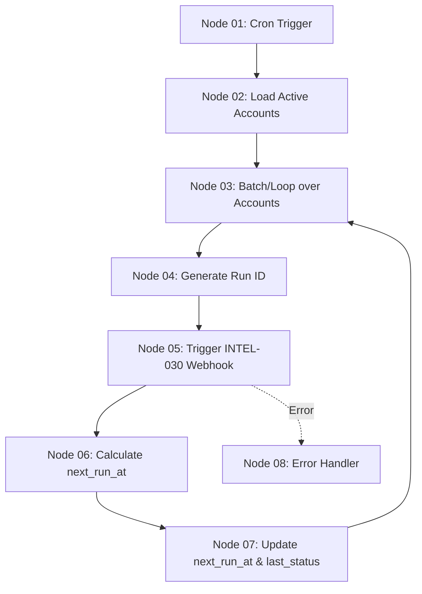

# Spécification Technique — Workflow n8n : Planificateur Périodique de Veille Compte (INTEL-031-account-watch-scheduler)

Ce document décrit en détail l'architecture, la configuration et le comportement du workflow n8n chargé d'orchestrer la veille automatique périodique sur les comptes ciblés. Il est directement exploitable pour la création du workflow sur le VPS n8n.

---

## 1. Objectif Fonctionnel
* **Planifier** l'exécution automatique quotidienne de la collecte de veille.
* **Identifier** tous les comptes surveillés actifs (`is_enabled = true`) dont la date de prochaine exécution (`next_run_at`) est échue ou non définie.
* **Déclencher** l'exécution en boucle du workflow `INTEL-030-account-watch-refresh` pour chaque compte éligible.
* **Calculer** et planifier la prochaine date d'exécution (`next_run_at`) en fonction du niveau de priorité de la veille.
* **Gérer les échecs** et protéger le système en désactivant automatiquement la veille après 5 échecs consécutifs.

---

## 2. Déclencheur (Trigger)
* **Cron Trigger** : Déclenchement temporel automatique configuré directement dans n8n.
  * **Cadence** : Quotidienne.
  * **Horaire conseillé** : Chaque jour à 03:00 AM UTC (pour disposer des signaux prêts au démarrage de la journée commerciale).

---

## 3. Flux de Données & Orchestration

Le planificateur n'effectue aucun scraping ou traitement de données lui-même. Il agit comme un **chef d'orchestre** :



---

## 4. Description Node par Node

### [Node 01] **Cron Trigger**
* **Type** : Schedule Trigger (n8n Core)
* **Configuration** :
  * Interval : `Daily`
  * Time : `03:00`
  * Timezone : `UTC`

### [Node 02] **Supabase: Load Active Watch Settings**
* **Type** : Supabase Node (ou HTTP Request calling REST API with Service Role)
* **Description** : Sélectionne les paramètres de veille des comptes actifs arrivés à échéance.
* **Requête SQL équivalente** :
  ```sql
  SELECT id, company_id, workspace_id, watch_level, cadence, metadata, last_run_at
  FROM public.account_watch_settings
  WHERE is_enabled = true
    AND (next_run_at IS NULL OR next_run_at <= now());
  ```

### [Node 03] **Split in Batches**
* **Type** : Loop / Split In Batches (n8n Core)
* **Configuration** :
  * Batch Size : `1` (pour traiter les comptes de manière séquentielle et éviter les pics de charge sur les API de collecte et le LLM).

### [Node 04] **Generate Run Context**
* **Type** : Code (JavaScript)
* **Description** : Génère un `runId` (UUID) unique et prépare le payload JSON requis par le workflow `INTEL-030-account-watch-refresh`.
* **Code exemple** :
  ```javascript
  const item = items[0].json;
  return {
    json: {
      runId: $uuid,
      workspaceId: item.workspace_id,
      companyId: item.company_id,
      triggerMode: 'auto',
      watchLevel: item.watch_level,
      settings: {
        isEnabled: true,
        watchLevel: item.watch_level,
        cadence: item.cadence,
        includeOfficialSite: item.include_official_site ?? true,
        includeNews: item.include_news ?? true,
        includeJobs: item.include_jobs ?? true,
        includePublicRecords: item.include_public_records ?? false,
        includeTenders: item.include_tenders ?? false,
        includeSocialManual: item.include_social_manual ?? true,
        queryAliases: item.query_aliases ?? []
      },
      callbackUrl: "https://kredo.app/api/n8n/callback"
    }
  };
  ```

### [Node 05] **HTTP Request: Trigger Watch Refresh**
* **Type** : HTTP Request (ou Execute Workflow)
* **Configuration** :
  * Method : `POST`
  * URL : URL du Webhook de `INTEL-030-account-watch-refresh`
  * Headers :
    * `Content-Type`: `application/json`
    * `x-n8n-signature`: Signature HMAC calculée sur le body
  * Body : Payload issu du [Node 04]

### [Node 06] **Calculate next_run_at**
* **Type** : Code (JavaScript)
* **Description** : Calcule le décalage de la prochaine date d'exécution en fonction du `watch_level` de la veille.
* **Règles de calcul** :
  * **`hot`** : Fréquence quotidienne &rarr; `+1 jour`
  * **`priority`** : Fréquence semi-hebdomadaire &rarr; `+3 jours`
  * **`standard`** (par défaut) : Fréquence hebdomadaire &rarr; `+7 jours`
* **Code exemple** :
  ```javascript
  const level = items[0].json.watch_level;
  const now = new Date();
  let nextRun = new Date();

  if (level === 'hot') {
    nextRun.setDate(now.getDate() + 1);
  } else if (level === 'priority') {
    nextRun.setDate(now.getDate() + 3);
  } else {
    nextRun.setDate(now.getDate() + 7);
  }

  // Définir l'exécution au matin (ex: 03:00 UTC)
  nextRun.setUTCHours(3, 0, 0, 0);

  return {
    json: {
      nextRunAt: nextRun.toISOString()
    }
  };
  ```

### [Node 07] **Supabase: Update next_run_at & last_status**
* **Type** : Supabase Node (ou HTTP Request with Service Role)
* **Description** : Met à jour la planification et réinitialise le statut dans `account_watch_settings`.
* **Champs mis à jour** :
  * `next_run_at` = `{{ $json.nextRunAt }}`
  * `last_status` = `'queued'` (car le run a été envoyé en file d'attente sur `INTEL-030`)
  * `last_error` = `null` (réinitialisation en cas de succès)

---

## 5. Gestion des Erreurs & Dispositif de Protection

### [Node 08] **Error Handler (Remédiation)**
Si le déclenchement de la mise à jour pour un compte donné échoue (timeout HTTP, base inaccessible, etc.), le flux est redirigé vers ce Node.

1. **Mise à jour des logs d'erreur** :
   * `last_status` = `'failed'`
   * `last_error` = Message d'erreur intercepté
2. **Incrémentation des échecs consécutifs via `metadata`** :
   Pour éviter de surcharger la base de données de schémas spécifiques, le compteur d'échecs consécutifs `consecutive_failures` est logé dans la colonne `metadata` (JSONB) :
   * `metadata = jsonb_set(metadata, '{consecutive_failures}', to_jsonb(coalesce((metadata->>'consecutive_failures')::int, 0) + 1))`
3. **Dispositif de sécurité (Circuit Breaker)** :
   * Si `consecutive_failures >= 5` :
     * Désactiver automatiquement la veille : `is_enabled = false`
     * Poster une alerte sur le canal Discord/Slack de support KREDO ou notifier le workspace.
   * Sinon :
     * **Laisser la veille activée** pour ne pas impacter les runs futurs en cas de défaillance réseau ou d'API temporaire.
     * Reprogrammer le prochain run normalement pour le lendemain (`+1 jour`) afin de retenter la collecte au cycle suivant.

---

## 6. Règles de Sécurité
* **Service Role Key** : Comme pour `INTEL-030`, les écritures automatiques de planification dans `account_watch_settings` s'exécutent avec le rôle `service_role` Supabase.
* **Signature de Callback** : La signature cryptographique HMAC-SHA256 est calculée pour authentifier l'orchestration interne entre workflows n8n.
