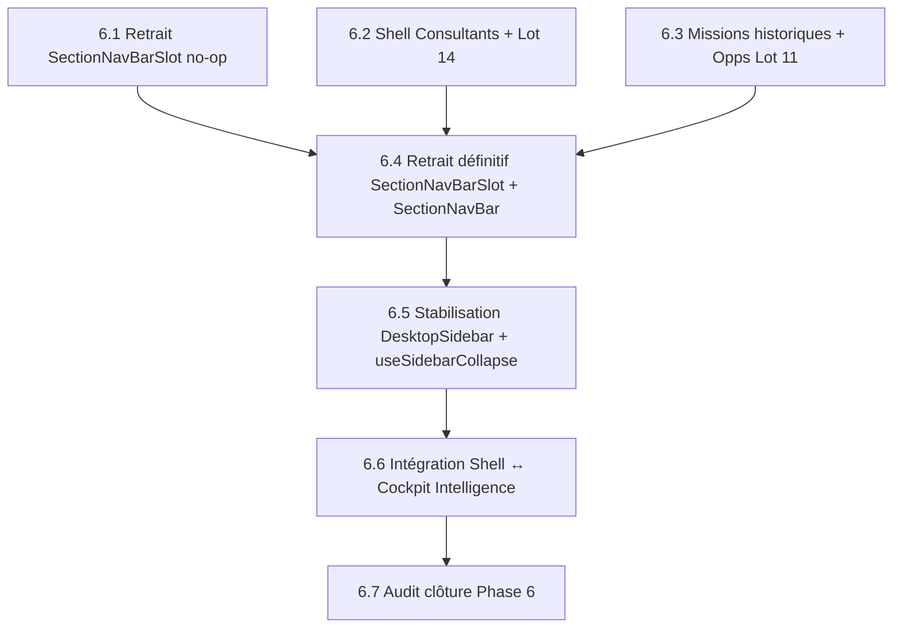

# SHELL-0018 — Audit d'entrée Phase 6 & Architecture cible

> ⚠️ **Partiellement supersédé (2026-09-09, Lot 6.3R).** La **taxonomie du menu principal** et la
> **structure interne des workspaces** (chapitres / modules) sont désormais fixées par
> `09-TARGET-NAVIGATION-ARCHITECTURE-2026-09-09.md` (cible canonique). Ce document **08** reste la
> référence pour l'**ownership technique** de la Phase 6 : `useSidebarCollapse`, bus sidebar,
> `SectionNavBarSlot` / `SectionNavBar`, collapse/expand, intégration Cockpit Intelligence.
> En cas de divergence sur un libellé ou une organisation de menu, **le document 09 fait foi.**

> **Lot :** 6.0 — Audit d'entrée & architecture cible du Shell global Desktop
> **Date :** 2026-09-09
> **Baseline Git :** `e0cab6f5` (main, synchronisé avec origin/main)
> **Branche :** `main` (branche unique)
> **Code applicatif modifié :** 0
> **Auteur :** Agent IA (audit statique sur le code source)

---

## 1. Shell global Desktop — Cartographie réelle

### 1.1 Arbre de responsabilité

```
App Router root layout (src/app/layout.tsx)
  └── (app)/layout.tsx                    ← Server Component, force-dynamic
        └── AppShell (server)             ← distribue Desktop vs Mobile
              │
              ├── [MOBILE] → bottom nav + FAB + overlays
              │
              └── [DESKTOP] → flex h-screen w-screen
                    │
                    ├── DesktopSidebar (client)
                    │     ├── Logo + toggle
                    │     ├── Nav modules (mainMenuItems)
                    │     ├── Bac à sable (legacy)
                    │     └── Footer (user + logout)
                    │
                    └── flex-1 (main content + Intelligence)
                          │
                          ├── relative flex-1 (content zone)
                          │     ├── <main> (scrollable, children)
                          │     │     └── [module layout] → SectionNavBarSlot + workspace
                          │     │           └── [workspace shell] → SectionRail + contenu
                          │     │
                          │     └── absolute z-30 (top-right)
                          │           ├── WorkflowExecutionIndicatorDesktop
                          │           └── IntelligenceToggle
                          │
                          └── IntelligencePanel (client, conditional)
                                ├── Header (Cockpit Intelligence)
                                ├── Account mode / Entity mode / Registry mode
                                └── Actions, Resources, Activity, Contacts
```

### 1.2 Couches détaillées

| Couche | Composant propriétaire | Client / Server | État global détenu | Largeur réservée | Collapse | Dépendances |
|---|---|---|---|---|---|---|
| **Root layout** | `(app)/layout.tsx` | Server | — | `100vw × 100vh` | — | `getDashboardDevice()` |
| **AppShell** | `AppShell.tsx` | Server | Lit cookie `kredo_sidebar_collapsed` | distribue Desktop/Mobile | — | `DesktopSidebar`, `MobileNav`, `IntelligencePanel`, `IntelligenceToggle`, `IntelligenceFAB` |
| **DesktopSidebar** | `DesktopSidebar.tsx` | Client | `useState(defaultCollapsed)`, `useSidebarCollapse` (récepteur), `useLegacySandboxStore` | `--layout-sidebar-width-collapsed` (4rem) / `--layout-sidebar-width-expanded` (14rem) | Oui : toggle utilisateur + bus `useSidebarCollapse` | `mainMenuItems`, cookie persistence |
| **Main content** | `<main>` dans AppShell | — | — | `flex-1` (tout l'espace restant) | Réagit au repli sidebar | — |
| **IntelligencePanel** | `IntelligencePanel.tsx` | Client | `useIntelligencePanel` (store open/close), `useIntelligenceContext`, `useSidebarCollapse` (émetteur) | `--layout-intelligence-width` = `--layout-drawer-width` | Quand ouvert → `requestCollapse()` sur sidebar | Registre d'actions contextuelles, panneau multi-entité |
| **IntelligenceToggle** | `IntelligenceToggle.tsx` | Client | `useIntelligencePanel.toggle()` | Bouton flottant top-right | — | — |
| **Module layouts** | `(app)/[module]/layout.tsx` | Server | — | `flex h-full` | — | Certains montent `SectionNavBarSlot` |
| **Workspace shells** | Ex. `ConsultantsDesktopShell`, `OpportunitiesDesktopShell`, `EngagementsDesktopView` | Client | Section rail, modules, `useSidebarCollapse` (émetteur) | Rail `w-[11.5rem]` (184px) + flex-1 contenu | Émettent `requestCollapse` au montage | `SectionRail`, navigation config locale |

---

## 2. Inventaire exhaustif — `useSidebarCollapse`

### 2.1 Définition du store

**Fichier :** `src/hooks/use-sidebar-collapse.ts`
**Nature :** Store Zustand `create<SidebarCollapseState>` — bus de requêtes one-shot.
**Mécanisme :** compteur de requêtes (`collapseRequestCount`), `pendingRequest` (boolean|null), `wasExpandedBeforePanel` pour restauration. DesktopSidebar est le **seul récepteur** : il écoute `pendingRequest` et applique à son `useState` local.

### 2.2 Consommateurs actuels (12 fichiers, 11 uniques)

| # | Fichier | Rôle | `requestCollapse` | `requestRestore` | Lit `isCollapsed` | Pilotage global légitime ? | Migration cible |
|---|---|---|---|---|---|---|---|
| 1 | **`DesktopSidebar.tsx`** | Récepteur unique | — | — | Lit `pendingRequest`, `collapseRequestCount`, appelle `consumeRequest`, `reportState` | **Oui** — propriétaire | Reste, simplifié |
| 2 | **`IntelligencePanel.tsx`** | Émetteur : replie la sidebar quand le panneau s'ouvre | ✅ | ✅ | Non | **Oui** — exclusion mutuelle avec sidebar | Reste (interface Shell ↔ Cockpit) |
| 3 | **`CrmTabbedShell.tsx`** | Émetteur : replie quand cockpit CRM actif | ✅ | ✅ | Non | **Oui** — le CRM multi-onglets est visuellement dense | Évaluer si `requestCollapse` via Shell plutôt que CRM |
| 4 | **`ConsultantsDesktopShell.tsx`** | Émetteur : replie au montage | ✅ | ✅ | Non | **Historique** — pattern copié des anciens shells | **Supprimer** — le Shell devrait auto-replier |
| 5 | **`OpportunitiesDesktopShell.tsx`** | Émetteur : replie au montage | ✅ | ✅ | Non | **Historique** — même pattern | **Supprimer** — le Shell devrait auto-replier |
| 6 | **`EngagementsDesktopView.tsx`** | Émetteur : replie au montage | ✅ | ✅ | Non | **Historique** — même pattern | **Supprimer** |
| 7 | **`ReportsDesktopView.tsx`** | Émetteur : replie au montage | ✅ | ✅ | Non | **Historique** — même pattern | **Supprimer** |
| 8 | **`BusinessIntelligenceDesktop.tsx`** | Émetteur : replie au montage | ✅ | ✅ | Non | **Historique** — même pattern | **Supprimer** |
| 9 | **`KnowledgeHubDesktop.tsx`** | Émetteur : replie au montage | ✅ | ✅ | Non | **Historique** — même pattern | **Supprimer** |
| 10 | **`VeilleActualitesDesktop.tsx`** | Émetteur : replie au montage | ✅ | ✅ | Non | **Historique** — même pattern | **Supprimer** |
| 11 | **`ProspectionIntelligenceDesktop.tsx`** | Émetteur : replie au montage | ✅ | ✅ | Non | **Historique** — même pattern | **Supprimer** |
| 12 | **`ProspectionIntelligenceHeader.tsx`** | Lecteur : lit `isCollapsed` pour ajuster un séparateur visuel | — | — | ✅ | **Marginal** — ajustement CSS mineur | **Supprimer** — remplacer par CSS ou layout-aware |

### 2.3 Analyse

**Qui doit posséder l'état de la sidebar à terme ?**
→ **Le Shell global (DesktopSidebar / AppShell)**. Aucune page métier ne devrait piloter directement le repli.

**Le comportement cible doit être :**
→ **Hybride** : le Shell auto-replie la sidebar quand une page équipée d'un `SectionRail` est active (détection côté Shell, pas côté workspace), et l'utilisateur peut toujours toggle manuellement. L'IntelligencePanel reste un émetteur légitime car il crée un conflit spatial exclusif.

**Usages purement historiques :** 8 sur 12 (n° 4 à 11) — ils répètent tous le même pattern `useEffect(() => { requestCollapse(); return () => requestRestore() }, [])`.

**Usages empêchant la suppression du store :**
- IntelligencePanel (exclusion mutuelle)
- CrmTabbedShell (CRM multi-onglets visuellement dense)
- DesktopSidebar (récepteur)

**Direction :** Le store peut être réduit à 2 émetteurs légitimes (IntelligencePanel + CrmTabbedShell) après que le Shell auto-replie par détection de layout.

---

## 3. Inventaire exhaustif — `SectionNavBarSlot` / `SectionNavBar`

### 3.1 `SectionNavBarSlot` — 6 montages dans les layouts

| # | Layout | Import + rendu | Tabs trouvés au runtime | Classification |
|---|---|---|---|---|
| 1 | `(app)/automations/layout.tsx` | ✅ importé, ✅ rendu | **0** (pas de tabs dans `main-menu.config.ts` pour `/automations`) | **B — no-op runtime** |
| 2 | `(app)/knowledge/layout.tsx` | ✅ importé, ✅ rendu | **0** (pas de tabs pour `/knowledge`) | **B — no-op runtime** |
| 3 | `(app)/finance/layout.tsx` | ✅ importé, ✅ rendu | **0** (pas de tabs pour `/finance`) | **B — no-op runtime** |
| 4 | `(app)/prospection/layout.tsx` | ✅ importé, ✅ rendu | **0** (pas de tabs pour `/prospection/accounts`) | **B — no-op runtime** |
| 5 | `(app)/missions/(tabbed)/layout.tsx` | ✅ importé, ✅ rendu | **3** tabs : Synthèse (`/missions`), Missions (`/missions/actives`), Projets (`/missions/projets`) | **A — consommateur fonctionnel réel** |
| 6 | `(app)/consultants/(tabbed)/layout.tsx` | ✅ importé, ✅ rendu | **3** tabs : Synthèse (`/consultants`), Pool de compétences (`/consultants/pool-competences`), Activité & congés (`/consultants/activite-conges`) | **A — consommateur fonctionnel réel** |

**Note :** Le layout `(app)/consultants/layout.tsx` ne monte plus `SectionNavBarSlot` (descendu dans `(tabbed)` depuis le chantier Consultants Workspace Lot 1). Confirmé par les tests `consultants-sections.test.ts`.

**Note :** Le layout `(app)/missions/layout.tsx` ne monte plus `SectionNavBarSlot` (descendu dans `(tabbed)` — le shell Engagements V2 utilise `SectionRail` via `?vue=`).

### 3.2 `SectionNavBar` — 1 consommateur

| Fichier | Consommé par |
|---|---|
| `SectionNavBar.tsx` | `SectionNavBarSlot.tsx` uniquement |

Dépendances de `SectionNavBar` :
- `getSectionTabsForPath()` de `main-menu.config.ts` — lit les `tabs` associés au pathname courant
- `useCrmAccountLauncherStore` — intercept spécial pour `/prospection/accounts` (ouvre le launcher CRM au lieu de naviguer)

### 3.3 Configs `main-menu.config.ts` alimentant `SectionNavBar`

Seules deux entrées possèdent un tableau `tabs` :

| Module | Tabs | Routes cibles | Encore fonctionnel ? |
|---|---|---|---|
| **Engagements** (`/missions`) | 3 tabs : `/missions`, `/missions/actives`, `/missions/projets` | Routes `(tabbed)` | **Oui** — affiché sous `missions/(tabbed)/layout.tsx` |
| **Équipe** (`/consultants`) | 3 tabs : `/consultants`, `/consultants/pool-competences`, `/consultants/activite-conges` | Routes `(tabbed)` | **Oui** — affiché sous `consultants/(tabbed)/layout.tsx` |

Aucune autre entrée ne porte de `tabs`. Les 4 no-ops confirment que `getSectionTabsForPath()` retourne `[]` pour ces routes, et `SectionNavBar` retourne `null`.

---

## 4. Audit Consultants

### 4.1 État actuel

Le workspace Consultants est **fonctionnellement migré** vers un shell V2 :
- Route principale : `/consultants` → `page.tsx` → Server Component distribue Desktop/Mobile
- Desktop : `ConsultantsDesktopShell` avec `SectionRail`, 5 chapitres : `synthese`, `collaborateurs`, `activite-conges`, `candidats`, `pool-competences`
- Contrat URL : `?section=` + `?module=` (Lots 12-13)
- 2 modules contextuels : Production & Congés, Matching profil

### 4.2 Dépendances Shell restantes

| Dépendance | Fichier | Nature | Impact SHELL 6.2 |
|---|---|---|---|
| `useSidebarCollapse` | `ConsultantsDesktopShell.tsx:67-68` | `requestCollapse` au montage | **À supprimer** — le Shell devrait auto-replier |
| `SectionNavBarSlot` | `consultants/(tabbed)/layout.tsx` | Barre horizontale pour `/consultants/activite-conges` et `/consultants/pool-competences` | **À supprimer** — ces sous-routes sont des vestiges avant la migration `?section=` |
| `main-menu.config.ts` tabs | Entrée `Équipe` avec 3 tabs | Alimente la barre horizontale historique | **À nettoyer** — supprimer les `tabs` une fois les sous-routes supprimées |
| Layout `(tabbed)/layout.tsx` | Layout intermédiaire | Monte `SectionNavBarSlot` | **À supprimer** avec les routes `(tabbed)` |
| CRM launcher | Via `main-menu.config.ts`, sidebar item `/consultants` | Sidebar module link | Conservé — mettre à jour le libellé si nécessaire |

### 4.3 Sous-routes `(tabbed)` encore présentes

| Route | Fonctionnelle ? | Remplacée par |
|---|---|---|
| `/consultants/activite-conges` | Oui (page encore servie) | `/consultants?section=activite-conges` dans le shell V2 |
| `/consultants/pool-competences` | Oui (page encore servie) | `/consultants?section=pool-competences` dans le shell V2 |

### 4.4 Ce que SHELL 6.2 + Consultants Lot 14 devront faire

1. **Supprimer** les sous-routes `(tabbed)/activite-conges` et `(tabbed)/pool-competences` (redirections vers `?section=`)
2. **Supprimer** `consultants/(tabbed)/layout.tsx`
3. **Supprimer** le tableau `tabs` de l'entrée `Équipe` dans `main-menu.config.ts`
4. **Supprimer** `requestCollapse/requestRestore` de `ConsultantsDesktopShell.tsx`
5. **Mettre à jour** les deep-links et le menu mobile si nécessaire
6. Coordination Consultants Lot 14 : intégration CRM/launcher/main-menu

---

## 5. Audit Missions / Opportunités

### 5.1 Architecture actuelle `/missions`

```
/missions                    → page.tsx (shell Engagements V2, SectionRail, ?vue=)
/missions/(tabbed)/          → layout.tsx (SectionNavBarSlot)
  ├── actives/page.tsx       → liste missions actives
  └── projets/page.tsx       → liste projets au forfait
/missions/opps/              → Opportunities Workspace (SectionRail, ?section=, ?opp=, ?module=)
  ├── page.tsx
  └── [id]/page.tsx
/missions/opps/[id]/modifier → édition opportunité
```

### 5.2 Sous-routes `(tabbed)` encore fonctionnelles

| Route | Fonctionnelle ? | Remplacée par | Encore accessible depuis |
|---|---|---|---|
| `/missions/actives` | Oui | `/missions?vue=missions-at` | `main-menu.config.ts` tabs, sidebar Engagements |
| `/missions/projets` | Oui | `/missions?vue=projets` | `main-menu.config.ts` tabs |

### 5.3 `MissionsTabbedShell`

Monté dans `missions/(tabbed)/layout.tsx`. Sert de wrapper pour les sous-routes `(tabbed)` avec distribution Desktop/Mobile. Dépend de `getDashboardDevice()`.

### 5.4 Opportunities Workspace

Route : `/missions/opps`
- Shell : `OpportunitiesDesktopShell` avec `SectionRail`, 4 chapitres (`synthese`, `besoins`, `avant-vente`, `planning`)
- 3 modules contextuels : Matching, Simulation, Post-Mortem
- Contrat URL : `?section=`, `?opp=`, `?module=`
- `useSidebarCollapse` : `requestCollapse` au montage (historique)

### 5.5 `/staffing` — non trouvé comme route

La route `/staffing` n'existe pas en tant que route dans le router. Le staffing est intégré dans `/missions/opps` via le chapitre `besoins`.

### 5.6 Ce que SHELL 6.3 + Opportunities Lot 11 devront traiter

1. **Supprimer** les sous-routes `missions/(tabbed)/actives` et `missions/(tabbed)/projets`
2. **Ajouter des redirections** `/missions/actives` → `/missions?vue=missions-at`, `/missions/projets` → `/missions?vue=projets`
3. **Supprimer** `missions/(tabbed)/layout.tsx`
4. **Supprimer** le tableau `tabs` de l'entrée `Engagements` dans `main-menu.config.ts`
5. **Supprimer** `MissionsTabbedShell` (wrapper devenu sans objet)
6. **Supprimer** `requestCollapse/requestRestore` de `OpportunitiesDesktopShell.tsx`
7. Coordination Opportunities Lot 11 : navigation globale, scope, menu

---

## 6. Audit CRM

### 6.1 Composants

| Composant | Fichier | Rôle |
|---|---|---|
| **`CrmTabbedShell`** | `src/components/accounts-contacts/CrmTabbedShell.tsx` | Shell multi-onglets CRM. Gère les panneaux compte montés simultanément (`hidden` CSS). `useSidebarCollapse` pour repli quand cockpit actif |
| **CRM Launcher** | `CrmAccountLauncherHost` (dynamique via `AppOverlayHosts`) | Overlay global pour ouvrir un compte |
| **`CrmSectionTabBar`** | Barre d'onglets comptes CRM | Onglets entité haut de page |
| **`CrmEntityPanel`** | Panneau d'intelligence compte embedded | Contient `ClientIntelligenceSidebar` avec `SectionRail` |

### 6.2 Relation avec DesktopSidebar

`CrmTabbedShell` émet `requestCollapse` quand le cockpit CRM Desktop est actif (`isCockpitActive`). Ce repli est légitime car le CRM multi-onglets + panneau intelligence occupe toute la largeur.

### 6.3 Navigation embedded multi-comptes

Le réducteur `embeddedAccountIntelligenceNavigationReducer` mémorise la section active par panneau. Quand un onglet est réactivé, sa section est restaurée dans l'URL via `router.replace()`.

**Invariant critique :** Ne jamais partager un seul `aiSection` entre tous les panneaux montés.

### 6.4 Impact futur

- CrmTabbedShell reste un émetteur légitime de `requestCollapse` (ou son remplacement Shell-aware)
- Le CRM Launcher est monté globalement via `AppOverlayHosts` — pas de dépendance Shell à traiter
- `SectionNavBarSlot` dans `prospection/layout.tsx` est un no-op (suppression Lot 6.1)

---

## 7. Audit Cockpit Intelligence

### 7.1 Dispositif actuel

| Composant | Montage | Rôle |
|---|---|---|
| **`IntelligencePanel`** | `AppShell.tsx` (Desktop uniquement) — `flex` sibling de la zone contenu | Panneau latéral droit, conditionnel (`isOpen`) |
| **`IntelligenceToggle`** | `AppShell.tsx` — flottant absolute top-right | Bouton toggle (dans une div `pointer-events-none`) |
| **`IntelligenceFAB`** | `AppShell.tsx` (Mobile uniquement) | Floating Action Button |

### 7.2 Stores / hooks

| Hook/Store | Fichier | Rôle |
|---|---|---|
| `useIntelligencePanel` | `src/hooks/use-intelligence-panel.ts` | Store Zustand : `isOpen`, `open`, `close`, `toggle` |
| `useIntelligenceContext` | `src/hooks/use-intelligence-context.ts` | Contexte entité courante (company / entity / page) |
| `useSidebarCollapse` | Voir §2 | IntelligencePanel émet `requestCollapse`/`requestRestore` |

### 7.3 Interaction avec DesktopSidebar

```
IntelligencePanel ouvre → requestCollapse() → sidebar se replie
IntelligencePanel ferme → requestRestore() → sidebar se redéploie (si elle était déployée avant)
```

Le mécanisme est symétrique et fonctionne grâce au compteur de requêtes (plusieurs émetteurs ne se marchent pas dessus).

### 7.4 Largeur et positionnement

- `IntelligencePanel` : `w-[var(--layout-intelligence-width)]` = `var(--layout-drawer-width)`
- Monté en `flex sibling` du contenu principal — il **pousse** le contenu (pas d'overlay)
- Border-left + bg `brand-primary` + `data-theme="cockpit"`

### 7.5 Ce que SHELL 6.6 devra intégrer

- L'IntelligencePanel est déjà correctement intégré dans le Shell global via `AppShell`
- Son interaction avec `useSidebarCollapse` est légitime et doit persister (sous une forme simplifiée)
- La seule simplification possible : quand le store sera réduit, la communication IntelligencePanel ↔ DesktopSidebar restera le dernier usage du bus, possiblement remplaçable par un mécanisme plus simple (props via AppShell, ou CSS container queries)
- Les « Accès rapides » du panneau sont marqués « Bientôt » — pas d'impact Shell

---

## 8. Architecture cible

### A. Ownership global

| Surface | Propriétaire cible |
|---|---|
| **DesktopSidebar** | `AppShell` / `DesktopSidebar.tsx` (inchangé) |
| **Collapse / expand** | **Le Shell global** décide du repli en fonction : (1) d'un signal IntelligencePanel ouvert, (2) de la préférence utilisateur persistée (cookie). Les workspaces ne pilotent plus le repli |
| **Main content geometry** | `flex-1` dans AppShell (inchangé) |
| **Cockpit Intelligence** | `IntelligencePanel.tsx` reste monté dans `AppShell`, seul interlocuteur légitime du bus sidebar |

### B. Ownership local (inchangé)

Chaque workspace métier reste propriétaire de :
- Son `SectionRail` (configuration, chapitres, modules contextuels)
- Le chapitre actif (dérivé de l'URL)
- Les modules contextuels
- L'état métier local

### C. Frontières

**Règle cible :** une feature métier ne dépend plus directement du fonctionnement interne du Shell global. Interfaces explicitement justifiées :

| Interface | Direction | Justification |
|---|---|---|
| `useSidebarCollapse.requestCollapse/Restore` | IntelligencePanel → DesktopSidebar | Exclusion mutuelle spatiale |
| `useSidebarCollapse.requestCollapse/Restore` | CrmTabbedShell → DesktopSidebar | Cockpit CRM multi-onglets (évaluer si le Shell peut auto-détecter) |
| `useSidebarCollapse.isCollapsed` | DesktopSidebar → ProspectionIntelligenceHeader | **À supprimer** — détail cosmétique, remplacer par CSS |

Tous les autres usages (8 workspaces émettant `requestCollapse` au montage) sont **historiques** et doivent être supprimés. Le Shell doit auto-replier quand il détecte qu'un workspace avec `SectionRail` est actif.

**Mécanisme d'auto-repli proposé :** le Shell peut détecter via le pathname (ou un signal layout) que la page courante contient un rail secondaire. Ce détail d'implémentation sera tranché en Lot 6.5.

### D. Navigation — contrats URL préservés

| Contrat | Workspaces | Stabilisé |
|---|---|---|
| `?section=` | Consultants, Opportunities, Veille, Reports, Automations, Prospection Intelligence, Knowledge Hub | ✅ |
| `?tab=` | Business Intelligence, Finance | ✅ |
| `?vue=` | Engagements | ✅ |
| `?aiSection=` | Account Intelligence | ✅ |
| `?domain=` | Knowledge Hub | ✅ |
| `?opp=`, `?module=` | Opportunities | ✅ |
| `?run=` | Automations | ✅ |
| `?segment=` | Business Intelligence | ✅ |

**Aucune nouvelle refonte URL.**

### E. Adaptive Design

Phase 6 est Desktop-first. Règles :
- Aucun composant Desktop lourd chargé puis masqué sur Mobile
- Les branches `getDashboardDevice()` / `isMobile` restent la gate serveur
- Les `SectionRail` ne sont montés que côté Desktop
- Le `MobileSectionRail` / `MobileNav` reste la branche Mobile

---

## 9. Graphe de dépendances — ordre de démantèlement



**6.1** n'a aucune dépendance amont.
**6.2** et **6.3** sont indépendants entre eux et peuvent être parallélisés.
**6.4** dépend de 6.1 + 6.2 + 6.3 (tous les consommateurs supprimés).
**6.5** dépend de 6.4 (le store n'est plus pollué par SectionNavBar).
**6.6** dépend de 6.5 (le bus sidebar est stabilisé).
**6.7** dépend de tout.

---

## 10. Roadmap Phase 6 — lots détaillés

### Lot 6.1 — Retrait des SectionNavBarSlot no-op

**Objectif :** Supprimer les 4 imports et rendus de `SectionNavBarSlot` dans les layouts où la barre retourne `null` au runtime.

**Fichiers :**
- `src/app/(app)/automations/layout.tsx`
- `src/app/(app)/knowledge/layout.tsx`
- `src/app/(app)/finance/layout.tsx`
- `src/app/(app)/prospection/layout.tsx`

**Dépendances :** Aucune.

**Changements :** Retrait de l'import + rendu `<SectionNavBarSlot />` dans chaque layout. Le reste du layout est inchangé.

**Hors périmètre :** Ne pas toucher aux composants `SectionNavBarSlot.tsx` ni `SectionNavBar.tsx` (encore utilisés par `missions/(tabbed)` et `consultants/(tabbed)`).

**Risques :** Quasi nuls — ces composants retournaient déjà `null`.

**Critères de sortie :** `typecheck` + `build` + 0 régression structurelle. Les 4 layouts ne contiennent plus aucune référence à `SectionNavBarSlot`.

---

### Lot 6.2 — Shell Consultants + coordination Consultants Lot 14

**Objectif :** Terminer la migration du module Consultants vers le shell V2, en supprimant les routes `(tabbed)` et le `SectionNavBarSlot` associé.

**Fichiers / zones :**
- `src/app/(app)/consultants/(tabbed)/` (suppression du dossier)
- `src/app/(app)/consultants/(tabbed)/layout.tsx`
- `src/app/(app)/consultants/(tabbed)/activite-conges/page.tsx`
- `src/app/(app)/consultants/(tabbed)/pool-competences/page.tsx`
- `src/lib/navigation/main-menu.config.ts` — retrait des `tabs` de l'entrée `Équipe`
- `src/features/consultants/desktop/ConsultantsDesktopShell.tsx` — retrait `useSidebarCollapse`
- Tests `consultants-sections.test.ts` — mise à jour

**Dépendances :**
- Consultants Lot 14 (intégration CRM) — coordination sur le menu et les liens
- Lot 6.1 (recommandé avant, pas bloquant)

**Changements autorisés :**
- Suppression des routes historiques avec redirections
- Nettoyage `main-menu.config.ts`
- Retrait de `requestCollapse/requestRestore` dans `ConsultantsDesktopShell`

**Hors périmètre :** Refonte visuelle, nouvelles features, Supabase, n8n.

**Risques :** Liens historiques partagés (deep-links `/consultants/activite-conges`) — mitigation par redirections.

**Critères de sortie :** Build green, plus de route `(tabbed)` Consultants, `SectionNavBarSlot` absent du module Consultants, tests mis à jour.

---

### Lot 6.3 — Missions historiques + coordination Opportunities Lot 11

**Objectif :** Supprimer les routes `(tabbed)` sous `/missions` et le `SectionNavBarSlot` associé. Aligner la navigation du menu sur le shell Engagements V2.

**Fichiers / zones :**
- `src/app/(app)/missions/(tabbed)/` (suppression du dossier)
- `src/app/(app)/missions/(tabbed)/layout.tsx`
- `src/app/(app)/missions/(tabbed)/actives/page.tsx`
- `src/app/(app)/missions/(tabbed)/projets/page.tsx`
- `src/components/missions/MissionsTabbedShell.tsx` — évaluer suppression
- `src/lib/navigation/main-menu.config.ts` — retrait des `tabs` de l'entrée `Engagements`
- `src/features/opportunities/desktop/OpportunitiesDesktopShell.tsx` — retrait `useSidebarCollapse`

**Dépendances :**
- Opportunities Lot 11 — coordination sur le scope et la navigation globale
- Lot 6.1 (recommandé avant, pas bloquant)

**Changements autorisés :**
- Suppression des routes avec redirections (`/missions/actives` → `/missions?vue=missions-at`)
- Nettoyage config
- Retrait de `requestCollapse/requestRestore` dans `OpportunitiesDesktopShell`

**Hors périmètre :** Modification de `/missions/opps`, refonte Opportunities.

**Risques :** Le menu mobile (`getMobileTabsForPath`) référence `/missions/actives` — à mettre à jour. Les pages `actives/page.tsx` et `projets/page.tsx` ont possiblement des imports de données spécifiques — vérifier si les vues `?vue=missions-at` et `?vue=projets` couvrent les mêmes fonctionnalités.

**Critères de sortie :** Build green, plus de route `(tabbed)` Missions, redirections en place, `SectionNavBarSlot` absent du module Missions, menu mobile cohérent.

---

### Lot 6.4 — Retrait définitif SectionNavBarSlot + SectionNavBar + configs

**Objectif :** Supprimer les composants legacy et les types associés.

**Fichiers :**
- `src/components/layout/SectionNavBarSlot.tsx` (suppression)
- `src/components/layout/SectionNavBar.tsx` (suppression)
- `src/components/layout/section-tab-styles.ts` (évaluer suppression)
- `src/lib/navigation/main-menu.config.ts` — retrait du type `SectionTab`, de `getModuleTabs()`, de `getSectionTabsForPath()`
- Tests impactés

**Dépendances :** 6.1 + 6.2 + 6.3 doivent être terminés (plus aucun consommateur).

**Changements :** Suppression pure. Aucune fonction remplacée — les navigations locales utilisent toutes `SectionRail`.

**Hors périmètre :** `getMobileTabsForPath` peut encore appeler `getSectionTabsForPath` (fallback) — vérifier et migrer si nécessaire.

**Risques :** Casse de build si un consommateur oublié importe `SectionNavBar`. Recherche exhaustive avant suppression.

**Critères de sortie :** Build green. Les composants `SectionNavBar*` n'existent plus dans le codebase. Aucun import résiduel.

---

### Lot 6.5 — Stabilisation DesktopSidebar + démantèlement useSidebarCollapse

**Objectif :** Réduire le store `useSidebarCollapse` à ses 2 émetteurs légitimes (IntelligencePanel, CrmTabbedShell) et supprimer les 8 usages historiques.

**Fichiers :**
- `src/hooks/use-sidebar-collapse.ts` — simplifier l'interface
- `src/components/layout/DesktopSidebar.tsx` — adapter (le Shell peut auto-replier si un SectionRail est détecté)
- `src/components/reports/ReportsDesktopView.tsx` — retrait `useSidebarCollapse`
- `src/features/business-intelligence/desktop/BusinessIntelligenceDesktop.tsx` — idem
- `src/features/knowledge-hub/KnowledgeHubDesktop.tsx` — idem
- `src/components/veille/VeilleActualitesDesktop.tsx` — idem
- `src/components/missions/engagements/EngagementsDesktopView.tsx` — idem
- `src/features/prospection-intelligence/desktop/ProspectionIntelligenceDesktop.tsx` — idem
- `src/features/prospection-intelligence/desktop/ProspectionIntelligenceHeader.tsx` — retrait lecture `isCollapsed`

**Dépendances :** 6.4 (les anciennes navigations sont supprimées, on ne risque plus de régression).

**Changements :** Retrait de `requestCollapse/requestRestore` des 8 composants. Implémentation optionnelle d'un auto-repli Shell-level (par pathname ou signal layout).

**Hors périmètre :** Refonte visuelle de la sidebar, changement de comportement push/overlay.

**Risques :** Le comportement post-migration doit être identique visuellement (sidebar repliée sur les pages denses). L'auto-repli Shell doit couvrir les mêmes cas. QA visuelle nécessaire (réservée à Guillaume).

**Critères de sortie :** Build green. `useSidebarCollapse` n'a plus que 3 consommateurs (DesktopSidebar + IntelligencePanel + CrmTabbedShell). Tests mis à jour.

---

### Lot 6.6 — Intégration Shell ↔ Cockpit Intelligence

**Objectif :** Finaliser l'intégration IntelligencePanel dans le Shell global stabilisé. Évaluer la simplification du bus.

**Fichiers / zones :**
- `src/hooks/use-sidebar-collapse.ts`
- `src/components/intelligence/IntelligencePanel.tsx`
- `src/components/layout/DesktopSidebar.tsx`
- `src/components/layout/AppShell.tsx`

**Dépendances :** 6.5 (store stabilisé).

**Changements autorisés :**
- Remplacement du store Zustand par un mécanisme plus simple (props callback via AppShell, ou maintien du store simplifié)
- Documentation de l'interface Shell ↔ Intelligence

**Hors périmètre :** Nouvelles features Intelligence, modification de l'UX du panneau.

**Risques :** Faibles — le mécanisme actuel fonctionne, il s'agit surtout d'une simplification.

**Critères de sortie :** Build green. L'interaction sidebar ↔ Intelligence est documentée et minimale.

---

### Lot 6.7 — Audit et clôture Phase 6

**Objectif :** Audit exhaustif de clôture prouvant l'absence de legacy Shell et la conformité de l'architecture.

**Fichiers :** Aucune modification applicative attendue. Documentation uniquement.

**Dépendances :** Tous les lots précédents.

**Critères de sortie :**
- 0 `SectionNavBarSlot` dans le codebase
- 0 `SectionNavBar` dans le codebase
- `useSidebarCollapse` réduit à ses consommateurs légitimes
- Aucun workspace n'importe `useSidebarCollapse`
- `main-menu.config.ts` ne contient plus de `tabs`
- Inventaire de clôture publié
- QA visuelle réservée à Guillaume

---

## 11. Risques et invariants

### Invariants à protéger

1. **Contrats URL** — Aucune modification des query params stabilisés (`?section=`, `?tab=`, `?vue=`, `?aiSection=`, `?domain=`, `?opp=`, `?module=`, `?run=`, `?segment=`)
2. **Account Intelligence embedded** — Ne jamais partager un `aiSection` entre panneaux CRM multi-comptes
3. **Mobile** — Ne jamais charger un composant Desktop lourd pour le masquer sur Mobile. Protéger les branches `getDashboardDevice()`
4. **SectionRail** — Aucune modification de la primitive (`w-[11.5rem]`, chapeau navy, séparation Chapitres/Modules)
5. **Cockpit Intelligence** — Les actions transverses restent hors des rails secondaires

### Risques identifiés

| Risque | Lot | Mitigation |
|---|---|---|
| Deep-links historiques cassés (`/consultants/activite-conges`, `/missions/actives`) | 6.2, 6.3 | Redirections Next.js `next.config.ts` ou pages de redirection |
| Menu mobile référence des routes `(tabbed)` dans `getMobileTabsForPath` | 6.3 | Mettre à jour en même temps |
| `section-tab-styles.ts` possiblement utilisé par `MobileSectionRail` | 6.4 | Vérifier les imports avant suppression |
| Auto-repli Shell ne couvre pas tous les cas (ex. CRM) | 6.5 | Conserver le bus pour CrmTabbedShell |
| QA visuelle non réalisable par l'agent | Tous | Réservée à Guillaume |

### Dettes explicitement reportées

- **Bac à sable Legacy** (`LegacySandboxStore`, `LegacyNavigationDrawer`) — présent dans `DesktopSidebar`, hors périmètre SHELL-0018
- **Accès rapides du Cockpit Intelligence** — marqués « Bientôt », pas de navigation fonctionnelle
- **`useCrmAccountLauncherStore`** dans `SectionNavBar.tsx` — intercept spécial `/prospection/accounts` ; à réévaluer après suppression de `SectionNavBar`
- **`MobileSectionRail`** — commentaire CSS « écho de la SectionNavBar desktop » à mettre à jour
- **Paramètres** (`/settings`) — pas de rail secondaire, pas de migration nécessaire

---

## 12. Résumé exécutif

| Dimension | Constat |
|---|---|
| **Shell global** | `AppShell` → `DesktopSidebar` + `main` + `IntelligencePanel`. Architecture saine, pas de refonte structurelle nécessaire |
| **`useSidebarCollapse`** | 12 fichiers, 8 usages historiques à supprimer, 2 émetteurs légitimes (Intelligence + CRM), 1 récepteur (Sidebar), 1 lecteur marginal |
| **`SectionNavBarSlot`** | 6 montages : 4 no-ops + 2 consommateurs réels (`missions/(tabbed)`, `consultants/(tabbed)`) |
| **`SectionNavBar`** | 1 seul consommateur (`SectionNavBarSlot`) — supprimable en même temps |
| **`main-menu.config.ts` tabs** | 2 entrées avec `tabs` (Engagements, Équipe) — à nettoyer |
| **Consultants** | Shell V2 complet, sous-routes `(tabbed)` vestigiales |
| **Opportunities** | Shell V2 complet, aucune dépendance Shell restante significative |
| **Missions legacy** | `(tabbed)` encore fonctionnel, doublon avec Engagements V2 |
| **CRM** | Multi-onglets fonctionnel, `requestCollapse` légitime |
| **Cockpit Intelligence** | Bien intégré dans AppShell, interaction sidebar fonctionnelle |
| **Ordre Phase 6** | 6.1 → 6.2/6.3 (parallélisables) → 6.4 → 6.5 → 6.6 → 6.7 |
